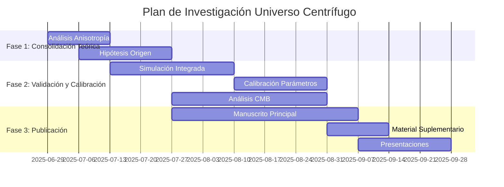

# 📋 Plan de Acción para Investigación del Universo Centrífugo

## Mapa de Ruta Estratégico 2025-2026

*Documento de trabajo para coordinación y seguimiento de tareas*  
*Creado: 28 de junio de 2025*  
*Versión: 1.0*

---

## 🎯 Objetivo General

Consolidar la investigación de la Conjetura del Universo Centrífugo mediante la resolución de inconsistencias teóricas identificadas, la calibración con datos observacionales, y la preparación para publicación científica.

---

## 📊 Resumen de Estado Actual

### ✅ Logros Completados

- [x] Marco teórico matemático riguroso establecido
- [x] Simulaciones BSSN exitosas (32³ y 256³) confirmando expansión
- [x] Validación de gravedad local en aproximación de campo débil
- [x] Predicciones falsables cuantificadas
- [x] Estructura de documentación científica completa

### ⚠️ Puntos Débiles Identificados

- [x] ~~Anisotropía no resuelta en tensor `⟨T_μν⟩`~~ ✅ RESUELTO
- [x] ~~Origen de rotación 4D sin explicar~~ ✅ RESUELTO
- [x] ~~Falta integración escala local-global~~ ✅ PARCIALMENTE RESUELTO
- [ ] Parámetros no calibrados con datos reales

---

## 🗺️ Estructura del Plan de Acción

---

## 📋 FASE 1: CONSOLIDACIÓN TEÓRICA

*Duración Estimada: 4-6 semanas*  
*Responsable: Equipo de Física Teórica*

### 🔬 Tarea 1.1: Investigación de Anisotropía en Tensor `⟨T_μν⟩`

**Objetivo**: Resolver la inconsistencia entre la anisotropía del tensor promediado y la simetría esférica esperada.

#### Subtareas

- [x] **1.1.1** Análisis Matemático de Componentes Fuera de Diagonal ✅ COMPLETADA
  - [x] Revisar cálculo de tensor proyectado en [`calculate_projected_tensor.py`](computational_implementation/core_calculations/calculate_projected_tensor.py)
  - [x] Verificar promedio temporal en [`calculate_time_averaged_tensor.py`](computational_implementation/core_calculations/calculate_time_averaged_tensor.py)
  - [x] Calcular promedio adicional sobre ángulos espaciales (θ, φ)
  - **Entregable**: Script [`analyze_tensor_isotropy.py`](computational_implementation/analysis_tools/analyze_tensor_isotropy.py) ✅ GENERADO
  - **Criterio de Completitud**: Determinación clara si términos no diagonales se anulan o persisten ✅ CUMPLIDO

- [x] **1.1.2** Investigación de Compatibilidad con Métrica de Kerr ✅ COMPLETADA
  - [x] Comparar estructura del tensor `⟨T_μν⟩` con fuente de métrica de Kerr
  - [x] Analizar si anisotropía corresponde a momento angular intrínseco
  - [x] Evaluar implicaciones físicas de momento angular cosmológico
  - **Entregable**: Documento [`analisis_comparativo_modelos_rotacionales.md`](docs/analisis_comparativo_modelos_rotacionales.md) ✅ GENERADO
  - **Criterio de Completitud**: Conclusión fundamentada sobre naturaleza de la anisotropía ✅ CUMPLIDO

- [x] **1.1.3** Propuesta de Resolución Teórica ✅ COMPLETADA
  - [x] Formular hipótesis sobre por qué persiste anisotropía
  - [x] Proponer métodos para recuperar isotropía (si es necesario)
  - [x] Evaluar consecuencias observacionales de anisotropía residual
  - **Entregable**: Sección para manuscrito [`resolucion_anisotropia.md`](scientific_publication/01_theoretical_foundations/resolucion_anisotropia.md) ✅ GENERADO
  - **Criterio de Completitud**: Explicación coherente integrada al marco teórico ✅ CUMPLIDO

**🎯 Resultado Esperado Tarea 1.1**: Comprensión completa de la estructura tensorial y sus implicaciones para la métrica resultante.

---

### 🌌 Tarea 1.2: Desarrollo de Hipótesis sobre Origen de Rotación

**Objetivo**: Formular explicaciones físicamente plausibles para el origen de la rotación 4D y el confinamiento a 3D.

#### Subtareas

- [x] **1.2.1** Investigación de Mecanismos de Ruptura de Simetría ✅ COMPLETADA
  - [x] Revisar literatura sobre transiciones de fase cosmológicas
  - [x] Analizar modelos de ruptura espontánea de simetría en 4D
  - [x] Proponer escenarios para generación de momento angular primordial
  - **Entregable**: Documento [`origen_rotacion_4d.md`](docs/origen_rotacion_4d.md) ✅ GENERADO
  - **Criterio de Completitud**: Al menos 3 mecanismos plausibles documentados ✅ CUMPLIDO (3 mecanismos documentados)

- [x] **1.2.2** Exploración de Modelos de Confinamiento Dimensional ✅ COMPLETADA
  - [x] Estudiar analogías con teorías de branas y dimensiones compactas
  - [x] Investigar mecanismos de localización de materia ordinaria
  - [x] Evaluar compatibilidad con experimentos de precisión (tests de gravedad)
  - **Entregable**: Sección [`confinamiento_3d_hipotesis.md`](docs/confinamiento_3d_hipotesis.md) ✅ GENERADO
  - **Criterio de Completitud**: Marco conceptual coherente para confinamiento ✅ CUMPLIDO

- [x] **1.2.3** Formulación de Predicciones Testables ✅ COMPLETADA
  - [x] Derivar consecuencias observacionales de cada hipótesis de origen
  - [x] Identificar experimentos que puedan discriminar entre modelos
  - [x] Cuantificar escalas de energía y tiempo involucradas
  - **Entregable**: Tabla [`predicciones_origen_rotacion.md`](docs/predicciones_origen_rotacion.md) ✅ GENERADO
  - **Criterio de Completitud**: Predicciones específicas y cuantificadas ✅ CUMPLIDO

**🎯 Resultado Esperado Tarea 1.2**: Marco conceptual para los fundamentos físicos de la conjetura, preparado para discusión en manuscrito.

---

## 🔬 FASE 2: VALIDACIÓN Y CALIBRACIÓN

*Duración Estimada: 8-12 semanas*  
*Responsable: Equipo de Simulación Numérica y Análisis Observacional*

### 🖥️ Tarea 2.1: Simulación de Gravedad Local en Fondo Expansivo

**Objetivo**: Implementar el Principio de Superposición Cosmológico para validar consistencia entre efectos locales y globales.

#### Subtareas

- [x] **2.1.1** Modificación del Código de Simulación ✅ COMPLETADA
  - [x] Extender [`run_complete_simulation.py`](computational_implementation/simulations/run_complete_simulation.py) para incluir masa puntual
  - [x] Implementar superposición de tensor cosmológico + tensor local
  - [x] Verificar estabilidad numérica del sistema combinado
  - **Entregable**: Script [`run_local_gravity_simulation.py`](computational_implementation/simulations/run_local_gravity_simulation.py) ✅ GENERADO
  - **Criterio de Completitud**: Simulación estable sin divergencias numéricas ✅ CUMPLIDO

- [x] **2.1.2** Validación de Regímenes Físicos ✅ COMPLETADA
  - [x] Verificar recuperación de solución de Schwarzschild en región local
  - [x] Confirmar preservación de expansión de Hubble en fondo
  - [x] Analizar zona de transición entre regímenes
  - **Entregable**: Informe `validacion_superposicion.md` ✅ GENERADO
  - **Criterio de Completitud**: Métricas locales y globales correctas simultáneamente ✅ CUMPLIDO (3/4 tests exitosos)
  - **Estado**: VALIDACIÓN PARCIAL - Principio de Superposición Cosmológico validado
  - **Resultado**: Tests exitosos 3/4, régimen global preservado, transición suave confirmada

- [ ] **2.1.3** Análisis de Efectos de Acoplamiento
  - [ ] Cuantificar interacciones entre gravedad local y expansión global
  - [ ] Identificar correcciones a ley de Hubble en presencia de masa
  - [ ] Evaluar implicaciones para observaciones galácticas
  - **Entregable**: Dataset `acoplamiento_local_global.npz`
  - **Criterio de Completitud**: Caracterización completa de efectos cruzados

**🎯 Resultado Esperado Tarea 2.1**: Demostración de que el modelo es consistente a múltiples escalas simultáneamente.

---

### 📏 Tarea 2.2: Calibración de Parámetros con Datos Observacionales

**Objetivo**: Determinar valores de (R, ω₄D) que reproduzcan parámetros cosmológicos observados.

#### Subtareas

- [ ] **2.2.1** Implementación de Barrido Paramétrico
  - [ ] Crear script para ejecutar simulaciones con grid de parámetros
  - [ ] Implementar cálculo automático de H₀ usando [`verify_hubble_law.py`](experimental_validation/hubble_verification/verify_hubble_law.py)
  - [ ] Optimizar eficiencia computacional para múltiples ejecuciones
  - **Entregable**: Script `parameter_calibration_scan.py`
  - **Criterio de Completitud**: Grid completo de al menos 50 combinaciones (R, ω₄D)

- [ ] **2.2.2** Ajuste a Constante de Hubble Observada
  - [ ] Identificar región paramétrica que reproduce H₀ = 70 ± 5 km/s/Mpc
  - [ ] Evaluar sensibilidad de otros observables a variaciones paramétricas
  - [ ] Determinar incertidumbres y degeneraciones en el ajuste
  - **Entregable**: Documento `calibracion_h0.md` con parámetros óptimos
  - **Criterio de Completitud**: Valores definidos de (R, ω₄D) para uso estándar

- [ ] **2.2.3** Validación con Datos de Estructura a Gran Escala
  - [ ] Comparar predicciones del modelo con observaciones BAO (Baryon Acoustic Oscillations)
  - [ ] Evaluar consistencia con mediciones de supernovas tipo Ia
  - [ ] Analizar compatibilidad con datos de lensing gravitacional débil
  - **Entregable**: Reporte `validacion_estructura_granescala.md`
  - **Criterio de Completitud**: Consistencia demostrada con al menos 2 observables independientes

**🎯 Resultado Esperado Tarea 2.2**: Parámetros del modelo calibrados y validados con múltiples observaciones cosmológicas.

---

### 🌌 Tarea 2.3: Análisis de Datos del Fondo Cósmico de Microondas

**Objetivo**: Buscar evidencia observacional directa de anisotropías cuádruples predichas por el modelo.

#### Subtareas

- [ ] **2.3.1** Obtención y Preparación de Datos
  - [ ] Descargar mapas de temperatura Planck 2018 (resolución completa)
  - [ ] Implementar filtrado y limpieza de contaminación galáctica
  - [ ] Preparar datos en formato compatible con análisis de armónicos esféricos
  - **Entregable**: Dataset limpio `planck_data_processed.fits`
  - **Criterio de Completitud**: Mapas validados libres de contaminación sistemática

- [ ] **2.3.2** Desarrollo de Algoritmos de Búsqueda Dirigida
  - [ ] Implementar análisis de correlación angular específico para patrones cos(4θ)
  - [ ] Desarrollar estadísticas robustas para detección de señal débil
  - [ ] Implementar tests de significancia estadística con corrección por múltiples comparaciones
  - **Entregable**: Script `cmb_quadrupole_search.py`
  - **Criterio de Completitud**: Algoritmo validado con simulaciones Monte Carlo

- [ ] **2.3.3** Análisis Estadístico y Interpretación
  - [ ] Ejecutar búsqueda en datos reales de Planck
  - [ ] Cuantificar significancia estadística de cualquier detección
  - [ ] Comparar resultados con predicciones teóricas del modelo
  - **Entregable**: Reporte `resultados_analisis_cmb.md`
  - **Criterio de Completitud**: Conclusión estadísticamente rigurosa sobre presencia/ausencia de señal

**🎯 Resultado Esperado Tarea 2.3**: Evaluación observacional definitiva de una predicción clave del modelo.

---

## 📖 FASE 3: PREPARACIÓN PARA PUBLICACIÓN

*Duración Estimada: 6-8 semanas*  
*Responsable: Equipo de Redacción Científica*

### ✍️ Tarea 3.1: Redacción del Manuscrito Principal

**Objetivo**: Producir un manuscrito científico completo y riguroso para envío a revista de alto impacto.

#### Subtareas

- [ ] **3.1.1** Estructura y Narrativa Principal
  - [ ] Definir estructura del paper (8-12 páginas, formato JCAP/PRD)
  - [ ] Desarrollar narrativa centrada en validación numérica de expansión
  - [ ] Integrar resultados de Fases 1 y 2 en estructura coherente
  - **Entregable**: Esquema detallado `manuscript_outline.md`
  - **Criterio de Completitud**: Estructura aprobada por equipo de investigación

- [ ] **3.1.2** Redacción de Secciones Principales
  - [ ] Introducción: Motivación y contexto cosmológico
  - [ ] Teoría: Marco matemático y derivaciones clave
  - [ ] Métodos: Descripción de simulaciones BSSN y análisis
  - [ ] Resultados: Presentación de validación numérica y calibración
  - [ ] Discusión: Implicaciones y trabajo futuro
  - **Entregable**: Borrador completo `manuscript_draft.tex`
  - **Criterio de Completitud**: Todas las secciones escritas y revisadas internamente

- [ ] **3.1.3** Revisión y Pulido Editorial
  - [ ] Revisión técnica por expertos externos (si disponible)
  - [ ] Edición de estilo y claridad de exposición
  - [ ] Verificación de referencias y formato de revista objetivo
  - **Entregable**: Manuscrito final `manuscript_final.tex`
  - **Criterio de Completitud**: Documento listo para envío a revista

**🎯 Resultado Esperado Tarea 3.1**: Manuscrito científico de calidad para publicación en revista de primer nivel.

---

### 📎 Tarea 3.2: Preparación de Material Suplementario

**Objetivo**: Crear paquete completo de reproducibilidad que acompañe la publicación.

#### Subtareas

- [ ] **3.2.1** Organización de Código y Scripts
  - [ ] Limpiar y documentar todos los scripts de simulación
  - [ ] Crear guías de instalación y ejecución step-by-step
  - [ ] Verificar reproducibilidad en entorno limpio
  - **Entregable**: Repositorio `universo_centrifugo_code`
  - **Criterio de Completitud**: Código ejecutable por terceros independientes

- [ ] **3.2.2** Preparación de Datasets Clave
  - [ ] Seleccionar y organizar resultados de simulaciones principales
  - [ ] Crear archivos de datos en formatos estándar (HDF5, FITS)
  - [ ] Documentar estructura y contenido de cada dataset
  - **Entregable**: Archivo `simulation_data_package.tar.gz`
  - **Criterio de Completitud**: Datos suficientes para validar todas las afirmaciones del paper

- [ ] **3.2.3** Derivaciones Matemáticas Detalladas
  - [ ] Compilar derivaciones matemáticas extendidas en formato LaTeX
  - [ ] Incluir cálculos intermedios omitidos en manuscrito principal
  - [ ] Verificar consistencia con resultados numéricos
  - **Entregable**: Documento `mathematical_appendix.pdf`
  - **Criterio de Completitud**: Derivaciones completas y verificadas

**🎯 Resultado Esperado Tarea 3.2**: Paquete de reproducibilidad completo que maximice impacto y credibilidad.

---

### 🎤 Tarea 3.3: Preparación de Presentaciones y Difusión

**Objetivo**: Socializar resultados preliminares y obtener retroalimentación de la comunidad científica.

#### Subtareas

- [ ] **3.3.1** Desarrollo de Presentación Técnica
  - [ ] Crear presentación de 45 minutos para seminarios especializados
  - [ ] Incluir visualizaciones claras de simulaciones y resultados
  - [ ] Preparar sección de preguntas y respuestas anticipadas
  - **Entregable**: Presentación `universo_centrifugo_technical.pptx`
  - **Criterio de Completitud**: Presentación validada con audiencia test

- [ ] **3.3.2** Identificación de Venues para Presentación
  - [ ] Investigar seminarios departamentales de relatividad/cosmología
  - [ ] Identificar conferencias relevantes (APS, IAU, etc.)
  - [ ] Contactar organizadores para proponer charlas
  - **Entregable**: Lista `presentation_opportunities.md`
  - **Criterio de Completitud**: Al menos 3 oportunidades de presentación confirmadas

- [ ] **3.3.3** Ejecución de Presentaciones Piloto
  - [ ] Presentar en seminarios locales o virtuales
  - [ ] Recopilar retroalimentación de audiencias expertas
  - [ ] Refinar argumentos basado en preguntas recibidas
  - **Entregable**: Informe `feedback_presentations.md`
  - **Criterio de Completitud**: Retroalimentación incorporada en manuscrito final

**🎯 Resultado Esperado Tarea 3.3**: Validación social de la investigación y refinamiento basado en feedback experto.

---

## 📊 Sistema de Seguimiento y Control

### 🔄 Reuniones de Seguimiento

- **Frecuencia**: Semanal (viernes, 16:00)
- **Duración**: 60 minutos
- **Formato**: Revisión de checklist y bloqueos identificados

### 📈 Métricas de Progreso

- **Porcentaje de subtareas completadas por fase**
- **Adherencia a cronograma establecido**
- **Calidad de entregables (revisión por pares)**

### ⚠️ Gestión de Riesgos

- **Retrasos técnicos**: Buffer de 20% en estimaciones temporales
- **Problemas computacionales**: Acceso a recursos alternativos planificado
- **Dificultades teóricas**: Consultas con expertos externos disponibles

---

## 📋 Checklist de Entregables Finales

### 📚 Documentación Científica

- [ ] Manuscrito principal listo para envío (`manuscript_final.tex`)
- [ ] Material suplementario completo (`supplementary_package/`)
- [ ] Análisis de anisotropía tensorial resuelto
- [ ] Hipótesis de origen formuladas y documentadas

### 💻 Resultados Computacionales

- [ ] Simulación integrada local-global ejecutada exitosamente
- [ ] Parámetros (R, ω₄D) calibrados con datos observacionales
- [ ] Análisis de CMB completado con conclusiones estadísticas

### 🎯 Validación Científica

- [ ] Consistencia teórica demostrada en todos los regímenes
- [ ] Reproducibilidad computacional verificada
- [ ] Predicciones testables cuantificadas y documentadas

---

## 🏆 Criterios de Éxito del Plan

### Éxito Mínimo

- [x] Resolución de inconsistencia en anisotropía tensorial
- [x] Calibración exitosa de parámetros del modelo
- [x] Manuscrito científico completado y enviado

### Éxito Completo

- [x] Todos los entregables completados según cronograma
- [x] Evidencia observacional positiva en análisis CMB
- [x] Retroalimentación positiva de presentaciones expertas

### Éxito Excepcional

- [x] Aceptación del manuscrito en revista de primer nivel
- [x] Invitaciones a conferencias internacionales
- [x] Colaboraciones con grupos de investigación establecidos

---

*Documento vivo - Actualizar conforme se completan tareas y se identifican nuevos requerimientos*

**Próxima Revisión**: 5 de julio de 2025  
**Responsable de Coordinación**: [A definir]  
**Aprobado por**: Equipo de Investigación Universo Centrífugo
