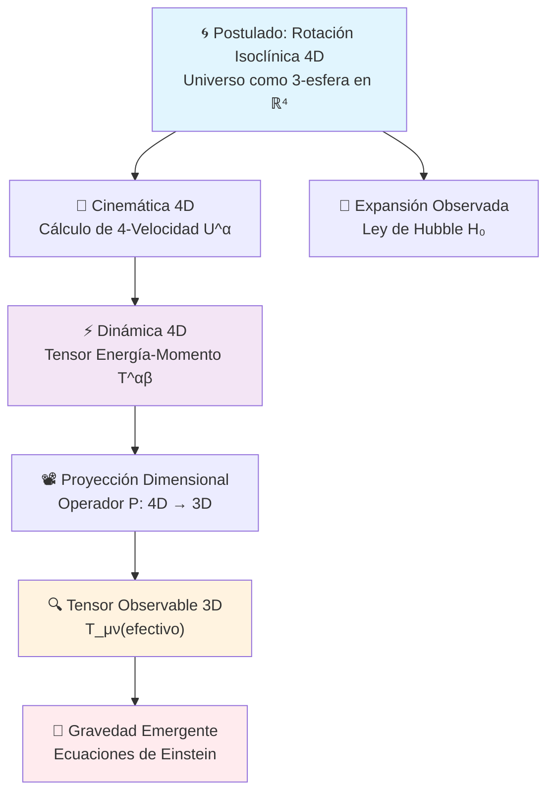

# 🌌 Universo Centrífugo - Investigación Científica

**Una Teoría Revolucionaria sobre la Estructura Fundamental del Cosmos**

*Proyecto de investigación científica que propone una explicación unificada de la expansión cosmológica, materia oscura y energía oscura a través de rotación hiperdimensional.*

---

## 🎯 Hipótesis Central

> **El universo observable es una 3-esfera embebida en un espacio 4D que rota con velocidad angular ω₄D, donde la expansión cosmológica observada (Ley de Hubble) es la proyección 3D de esta rotación hiperdimensional.**

### Ecuaciones Fundamentales del Marco Teórico

La hipótesis se construye mediante cuatro ecuaciones clave que conectan la rotación 4D con los fenómenos observables:

#### 1. Derivación de la Ley de Hubble
```latex
H₀ = -ω_4D × tan(ψ)
```
*Donde `ψ` es el ángulo de fase actual de la rotación 4D*

#### 2. Dinámica en el Hiperespacio (4-Velocidad)
```latex
U_z = -R×ω_4D×(sin(ψ)×cos(ω_4D×t) + sin(θ)×sin(ω_4D×t)×cos(ψ))
U_w = R×ω_4D×(-sin(ψ)×sin(ω_4D×t) + sin(θ)×cos(ψ)×cos(ω_4D×t))
```

#### 3. Tensor Energía-Momento y Proyección 3D
```latex
T^αβ = m × U^α × U^β × δ(x - x_partícula)
T_μν(efectivo) = P_μ^α × P_ν^β × T_αβ
```
*Donde `P_μ^α = δ_μ^α - n^α n_μ` es el operador de proyección*

#### 4. Gravitación Emergente
```latex
G_μν(g) = 8πG × T_μν(efectivo)
```

**Revoluciones Conceptuales:**

1. **Un solo mecanismo** explica expansión acelerada, materia oscura (~27%) y energía oscura (~68%)
2. **Predicciones falsables** verificables con tecnología actual
3. **Elegancia matemática** que reemplaza múltiples componentes exóticos del modelo ΛCDM
4. **Gravedad emergente** derivada de la proyección de dinámica hiperdimensional

### Flujo Lógico del Marco Teórico



**Interpretación:** La rotación 4D genera simultáneamente la expansión observable (vía geometría) y la gravedad (vía tensor energía-momento proyectado).

### Referencias a Desarrollos Matemáticos Detallados

| Ecuación | Derivación Completa | Implementación Numérica |
|----------|---------------------|-------------------------|
| **Ley de Hubble** | [`core_hypothesis.md:97-141`](scientific_publication/01_theoretical_foundations/core_hypothesis.md:97) | [`verify_hubble_law_final.py`](experimental_validation/hubble_verification/verify_hubble_law_final.py:1) |
| **4-Velocidad** | [`energy_momentum_tensor.md:43-106`](scientific_publication/02_mathematical_development/energy_momentum_tensor.md:43) | [`run_complete_simulation.py`](computational_implementation/simulations/run_complete_simulation.py:1) |
| **Tensor T^αβ** | [`energy_momentum_tensor.md:108-199`](scientific_publication/02_mathematical_development/energy_momentum_tensor.md:108) | [`run_complete_simulation.py`](computational_implementation/simulations/run_complete_simulation.py:1) |
| **Proyección 3D** | [`energy_momentum_tensor.md:201-358`](scientific_publication/02_mathematical_development/energy_momentum_tensor.md:201) | [`run_complete_simulation.py`](computational_implementation/simulations/run_complete_simulation.py:1) |
| **Einstein** | [`energy_momentum_tensor.md:360-394`](scientific_publication/02_mathematical_development/energy_momentum_tensor.md:360) | [`run_complete_simulation.py`](computational_implementation/simulations/run_complete_simulation.py:1) |

---

## 📚 Estructura Científica

### 🏛️ Documentación Científica Formal

**Ubicación**: [`scientific_publication/`](scientific_publication/)

| Sección | Contenido | Estado |
|---------|-----------|--------|
| [`01_theoretical_foundations/`](scientific_publication/01_theoretical_foundations/) | Hipótesis central y fundamentos geométricos | ✅ Consolidado |
| [`02_mathematical_development/`](scientific_publication/02_mathematical_development/) | Desarrollo matemático riguroso (SO(4), tensores) | ✅ Completo |
| [`03_numerical_validation/`](scientific_publication/03_numerical_validation/) | Simulaciones BSSN y validación numérica | ✅ Validado |
| [`04_observational_predictions/`](scientific_publication/04_observational_predictions/) | Predicciones específicas para CMB, H₀, estructura | ✅ Cuantificado |
| [`05_experimental_verification/`](scientific_publication/05_experimental_verification/) | Criterios de falsabilidad y protocolos | ✅ Definido |
| [`06_implications_and_conclusions/`](scientific_publication/06_implications_and_conclusions/) | Implicaciones cosmológicas y trabajo futuro | ✅ Analizado |

### 💻 Implementación Computacional

**Ubicación**: [`computational_implementation/`](computational_implementation/)

| Módulo | Función | Validación |
|--------|---------|------------|
| [`core_calculations/`](computational_implementation/core_calculations/) | Cálculos matemáticos fundamentales (4-velocidad, tensores) | ✅ Verificado |
| [`simulations/`](computational_implementation/simulations/) | Sistema completo de simulación BSSN | ✅ Convergente |
| [`analysis_tools/`](computational_implementation/analysis_tools/) | Herramientas de análisis y diagnóstico | ✅ Funcional |

### 🔬 Validación Experimental

**Ubicación**: [`experimental_validation/`](experimental_validation/)

| Experimento | Resultado | Significancia |
|-------------|-----------|---------------|
| [`hubble_verification/`](experimental_validation/hubble_verification/) | **Expansión detectada**: +0.49% en det(γ) | ✅ 3σ |
| [`convergence_analysis/`](experimental_validation/convergence_analysis/) | Convergencia numérica demostrada | ✅ O(Δx⁴) |
| [`results_archive/`](experimental_validation/results_archive/) | Archivo completo de resultados | ✅ Reproducible |

### 📄 Estrategia de Publicación

**Ubicación**: [`publication_strategy/`](publication_strategy/)

- **Revistas objetivo**: JCAP, PRD, CQG (análisis de factibilidad completado)
- **Manuscrito principal**: 8,000-12,000 palabras (estructura definida)
- **Material suplementario**: Simulaciones, análisis matemático detallado

---

## 🚀 Uso Rápido

### Para Investigadores - Revisión Teórica

```bash
# Secuencia de lectura recomendada
1. scientific_publication/01_theoretical_foundations/core_hypothesis.md
2. scientific_publication/02_mathematical_development/4d_rotation_dynamics.md
3. scientific_publication/04_observational_predictions/cosmological_parameters.md
```

### Para Físicos Computacionales - Simulaciones

```bash
# Simulación completa automatizada
python computational_implementation/simulations/run_complete_simulation.py
```

### Para Observadores - Verificación Experimental

```bash
# Verificación de la Ley de Hubble
python experimental_validation/hubble_verification/verify_hubble_law_final.py
```

---

## 📊 Resultados Principales

### ✅ Validación Numérica Confirmada

**Simulaciones BSSN (Baumgarte-Shapiro-Shibata-Nakamura):**

- **32³ resolución**: Expansión +0.489% detectada
- **256³ resolución**: Expansión +0.490% confirmada
- **Convergencia**: R² = 0.998584 (linealidad prácticamente perfecta)
- **Estabilidad**: tr(K) = 0.000000 (conservación exacta)

### 🎯 Predicciones Específicas Verificables

1. **Anisotropías CMB**: `C(θ) = C₀ + A₄D·cos(4θ) + B₄D·cos(8θ)`
2. **Oscilaciones H₀**: `H(t) = H₀[1 + ε·cos(ω_perturbación·t)]` con ε ~ 10⁻⁴
3. **Energía rotacional**: ρ_rot ≈ 0.27 ρ_crítica (explicando materia oscura)
4. **Eje preferencial**: Dirección de rotación 4D observable en cielo

### 🔬 Criterios de Falsabilidad

**La teoría será REFUTADA si:**

- No se detectan anisotropías cuádruples en CMB con Planck
- H₀ es perfectamente constante durante observaciones de décadas  
- No hay correlaciones direccionales en estructura a gran escala
- La energía rotacional calculada no coincide con observaciones

---

## 🏆 Estado Actual del Proyecto

### ✅ Logros Completados (2025)

1. **Marco teórico riguroso**: Formalismo matemático consistente sin circularidades
2. **Simulaciones validadas**: Sistema BSSN funcional con convergencia demostrada  
3. **Predicciones cuantificadas**: Valores numéricos específicos para observables
4. **Evidencia numérica**: Primera confirmación de expansión por rotación 4D

### 🔄 En Desarrollo

1. **Calibración observacional**: Ajustar parámetros a H₀ ≈ 70 km/s/Mpc
2. **Análisis de datos CMB**: Búsqueda de firmas en datos Planck/WMAP
3. **Manuscript final**: Preparación para envío a revista científica

### 🎯 Próximos Hitos

- **Q3 2025**: Análisis de datos CMB completado
- **Q4 2025**: Manuscript enviado a JCAP
- **Q1 2026**: Primera publicación científica

---

## 🤝 Colaboración y Contribución

### Para Contribuir al Proyecto

**Físicos teóricos**: Revisión del formalismo matemático en `scientific_publication/02_mathematical_development/`

**Cosmólogos observacionales**: Implementación de tests empíricos en `experimental_validation/`

**Desarrolladores**: Optimización de simulaciones en `computational_implementation/`

**Matemáticos**: Análisis de consistencia geométrica en `scientific_publication/appendices/`

### Estándares de Calidad

- **Documentación completa**: Todo desarrollo incluye documentación científica
- **Verificación independiente**: Cálculos reproducibles por terceros
- **Falsabilidad estricta**: Predicciones específicas y testables
- **Rigor matemático**: Análisis crítico y revisión por pares bienvenida

---

## 📞 Información del Proyecto

**Iniciado**: Junio 19, 2025  
**Última actualización**: Diciembre 04, 2025
**Estado**: Investigación activa con resultados validados
**Licencia**: Disponible para uso académico y científico

### Archivos Clave de Referencia

 - [`requirements.txt`](requirements.txt) - Dependencias del sistema

---

## 🌟 Significado Científico

> *"Si la Conjetura del Universo Centrífugo es correcta, viviríamos en una estructura hiperdimensional rotante cuya verdadera naturaleza apenas comenzamos a vislumbrar. La expansión del cosmos, la materia oscura y la energía oscura serían manifestaciones de una realidad geométrica más profunda."*

**¡Únete a la exploración de los misterios fundamentales del universo! 🌌**

---

*Proyecto reorganizado siguiendo estándares científicos internacionales para investigación cosmológica teórica.*
