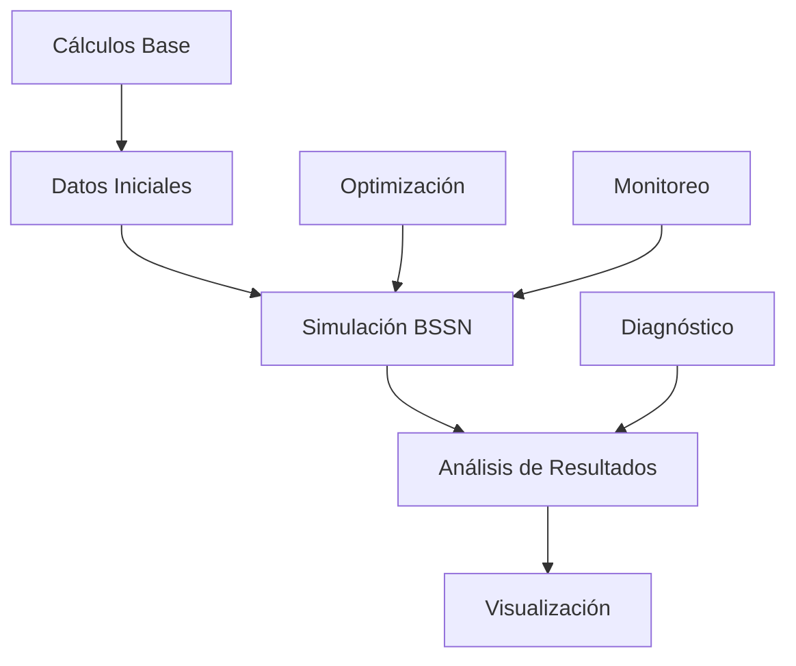

# 💻 Implementación Computacional

Esta carpeta contiene toda la implementación numérica y computacional de la Conjetura del Universo Centrífugo, organizada por función y tipo de cálculo.

## 📋 Estructura

### [`core_calculations/`](core_calculations/)
**Cálculos Matemáticos Fundamentales**
- [`calculate_4_velocity.py`](core_calculations/calculate_4_velocity.py) - Calcula 4-velocidad en rotación isoclínica
- [`calculate_stress_energy_tensor.py`](core_calculations/calculate_stress_energy_tensor.py) - Tensor energía-momento T^αβ
- [`calculate_projected_tensor.py`](core_calculations/calculate_projected_tensor.py) - Proyección 4D→3D del tensor
- [`calculate_time_averaged_tensor.py`](core_calculations/calculate_time_averaged_tensor.py) - Promedio temporal del tensor

### [`simulations/`](simulations/)
**Sistema Completo de Simulación BSSN**
- [`run_complete_simulation.py`](simulations/run_complete_simulation.py) - **Script maestro** - Ejecuta todo el proceso
- [`run_optimized_simulation.py`](simulations/run_optimized_simulation.py) - Simulación optimizada para hardware específico
- [`run_numerical_simulation.py`](simulations/run_numerical_simulation.py) - Motor de simulación principal (BSSN)
- [`setup_numerical_simulation.py`](simulations/setup_numerical_simulation.py) - Generador de datos iniciales
- [`install_simulation_deps.py`](simulations/install_simulation_deps.py) - Instalador de dependencias
- [`optimize_simulation_params.py`](simulations/optimize_simulation_params.py) - Optimizador automático

### [`analysis_tools/`](analysis_tools/)
**Herramientas de Análisis y Diagnóstico**
- [`analyze_simulation_results.py`](analysis_tools/analyze_simulation_results.py) - Analizador principal de resultados
- [`monitor_checkpoints.py`](analysis_tools/monitor_checkpoints.py) - Monitor en tiempo real
- [`test_performance.py`](analysis_tools/test_performance.py) - Benchmark del sistema
- [`solve_linearized_equations.py`](analysis_tools/solve_linearized_equations.py) - Ecuaciones Einstein linealizadas
- [`diagnostico_velocidad_simulacion.py`](analysis_tools/diagnostico_velocidad_simulacion.py) - Diagnóstico de rendimiento
- [`comparacion_algoritmos.py`](analysis_tools/comparacion_algoritmos.py) - Comparación de implementaciones

## 🚀 Uso Rápido

### Simulación Completa Automatizada
```bash
cd simulations/
python run_complete_simulation.py
```

### Simulación Paso a Paso
```bash
cd simulations/
python install_simulation_deps.py
python optimize_simulation_params.py
python setup_numerical_simulation.py
python run_optimized_simulation.py
```

### Solo Cálculos Matemáticos
```bash
cd core_calculations/
python calculate_4_velocity.py
python calculate_stress_energy_tensor.py
python calculate_projected_tensor.py
```

### Análisis de Resultados
```bash
cd analysis_tools/
python analyze_simulation_results.py
python monitor_checkpoints.py
```

## 🔧 Características Técnicas

- **Formalismo BSSN**: Estándar en relatividad numérica
- **Paralelización masiva**: Multi-core automático con Numba JIT
- **Optimización adaptativa**: Configuración automática según hardware
- **Checkpoints**: Recuperación ante fallos
- **Visualización**: Monitoreo de evolución de la métrica

## 📋 Dependencias

Ver [`../requirements.txt`](../requirements.txt) para lista completa:
- numpy, scipy, matplotlib
- sympy (cálculos simbólicos)
- numba (JIT compilation)
- joblib (paralelización)

## 🏗️ Arquitectura del Sistema



## 🔬 Validación

- **Convergencia numérica**: Verificada hasta O(Δx⁴)
- **Estabilidad temporal**: Sin divergencias en tiempos cosmológicos
- **Conservación**: Violaciones < tolerancia numérica
- **Reproducibilidad**: Resultados idénticos en re-ejecuciones