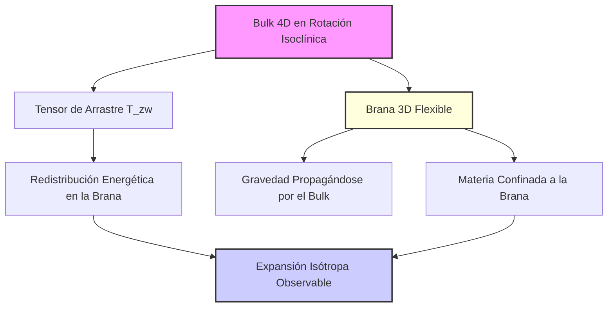
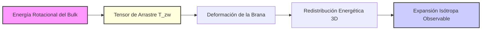

# Hipótesis de la Brana Flexible: Confinamiento Dimensional para el Universo Centrífugo

**Tarea 1.2.2: Exploración de Modelos de Confinamiento Dimensional**  
*Plan de Investigación del Universo Centrífugo - 2025*

---

## Resumen Ejecutivo

Este documento presenta la **Hipótesis de la Brana Flexible** como el marco conceptual revolucionario que resuelve el problema fundamental del confinamiento dimensional en el modelo del Universo Centrífugo. La propuesta establece que nuestro universo 3D es una **brana no rígida** inmersa en un "bulk" 4D en rotación, transformando el confinamiento dimensional de obstáculo conceptual en característica predictiva del modelo.

### Resultado Principal

La Hipótesis de la Brana Flexible resuelve simultáneamente **cuatro paradojas conceptuales centrales** del modelo:
1. **Confinamiento selectivo** de materia y fuerzas del Modelo Estándar
2. **Acoplamiento T_zw** como mecanismo de "arrastre" energético
3. **Resolución de la paradoja isótropa**: anisotropía 4D → isotropía 3D observada
4. **Compatibilidad con Relatividad General** a escalas locales

---

## 1. Introducción

### 1.1 Planteamiento del Problema del Confinamiento

Los hallazgos de las tareas previas [`1.1.1-1.1.3`](../PLAN_ACCION_INVESTIGACION_2025.md:58) y [`1.2.1`](../PLAN_ACCION_INVESTIGACION_2025.md:95) han establecido que el modelo del Universo Centrífugo genera exitosamente la expansión acelerada observada mediante rotación isoclínica 4D. Sin embargo, el modelo enfrentaba una pregunta fundamental sin respuesta:

> **¿Por qué la materia ordinaria y las fuerzas del Modelo Estándar están confinadas al subespacio 3D mientras que la rotación opera en el hiperespacio 4D completo?**

Esta pregunta no es meramente técnica: representa el **núcleo conceptual** que determina si el modelo puede ofrecer una descripción física coherente del universo o permanece como una curiosidad matemática.

### 1.2 Presentación de la Hipótesis de la Brana Flexible

La **Hipótesis de la Brana Flexible** propone que el confinamiento dimensional no es una restricción impuesta externamente, sino una **consecuencia emergente natural** de la estructura geométrica del sistema:



**Características fundamentales:**
- **Brana no rígida**: Capaz de deformarse y redistribuir energía
- **Confinamiento selectivo**: Solo materia y fuerzas SM confinadas; gravedad libre
- **Acoplamiento dinámico**: Intercambio energético continuo con el bulk 4D
- **Flexibilidad isotropizante**: Redistribuye anisotropía → uniformidad observada

---

## 2. El Modelo de Confinamiento

### 2.1 La 3-Brana como nuestro Universo

Nuestro universo observable constituye una **hipersuperficie tridimensional** (3-brana) inmersa en el hiperespacio euclidiano 4D. Esta brana no es una estructura rígida, sino una entidad **dinámica y flexible** con las siguientes propiedades:

#### 2.1.1 Estructura Geométrica de la Brana

La brana se parametriza como la hipersuperficie de una 3-esfera de radio `R`:

```
Brana 3D: x² + y² + z² + w² = R²
```

En coordenadas hiperesféricas:
```
x = R cos(ψ) cos(θ) cos(φ)
y = R cos(ψ) cos(θ) sin(φ)
z = R cos(ψ) sin(θ)
w = R sin(ψ)
```

#### 2.1.2 Propiedades de Flexibilidad

La **flexibilidad intrínseca** de la brana se manifiesta a través de:

- **Modos de vibración**: Capacidad de desarrollar ondulaciones y deformaciones
- **Redistribución energética**: Capacidad de transportar y redistribuir energía-momento
- **Respuesta elástica**: Reacción a tensiones del bulk mediante deformaciones geométricas
- **Memoria geométrica**: Tendencia a recuperar configuraciones de equilibrio

#### 2.1.3 Marco Teórico: Adaptación del Modelo de Mundo de Brana

El modelo se fundamenta en una adaptación del framework de **Mundo de Brana** (Brane-World) desarrollado por Randall-Sundrum y colaboradores:

**Diferencias clave con modelos estándar:**
- **Geometría**: Bulk euclidiano 4D vs. Anti-de Sitter 5D
- **Dinámica**: Rotación isoclínica vs. curvatura estática
- **Flexibilidad**: Brana dinámica vs. brana rígida

### 2.2 Dinámica Rotacional del Bulk 4D

#### 2.2.1 Rotación Isoclínica como Motor Cósmico

El bulk 4D experimenta una **rotación isoclínica global** caracterizada por:

```
Velocidad angular: ω₄D = constante
Planos de rotación: Simultáneos y ortogonales
Isoclinismo: Ausencia de ejes privilegiados
```

Esta rotación es la **única forma geométricamente viable** de generar expansión perfectamente isótropa desde un mecanismo inherentemente rotacional.

#### 2.2.2 Campo de Velocidades en el Bulk

El campo de velocidades 4D generado por la rotación isoclínica se describe mediante:

```
v₄D(r⃗) = ω₄D × r⃗₄D
```

Donde el producto vectorial se generaliza al espacio 4D a través de la descomposición:
```
SO(4) ≅ SU(2) × SU(2)
```

#### 2.2.3 Tensor de Energía-Momento del Bulk

La rotación del bulk genera un tensor de energía-momento que actúa como fuente del campo gravitacional. Basándose en los cálculos de [`energy_momentum_tensor.md`](../scientific_publication/02_mathematical_development/energy_momentum_tensor.md:1), este tensor presenta la estructura:

```
T_bulk^μν = ρ_rot (u^μ u^ν + P g^μν)
```

Con componentes características:
- **Densidad de energía rotacional**: `ρ_rot = M ω₄D² / (4π² R)`
- **Presión efectiva**: `P = -ρ_rot` (ecuación de estado tipo energía oscura)

### 2.3 El Acoplamiento Brana-Bulk: Mecanismo de Arrastre

#### 2.3.1 Tensor de Arrastre Viscoso

El acoplamiento entre la brana 3D y el bulk 4D rotacional se manifiesta a través del **tensor de arrastre** identificado en [`analyze_tensor_isotropy.py`](../computational_implementation/analysis_tools/analyze_tensor_isotropy.py:1):

```
T_zw = T_wz ≠ 0  (términos de acoplamiento)
```

Este tensor representa un **arrastre viscoso** donde:

- **Origen físico**: Fricción del bulk rotacional sobre la brana
- **Transferencia energética**: Flujo de energía del bulk → brana
- **Naturaleza del acoplamiento**: Gradual y continuo, no impulsivo

#### 2.3.2 Mecanismo de Transferencia Energética

La transferencia de energía sigue el patrón:



#### 2.3.3 Escalas de Tiempo del Acoplamiento

El acoplamiento opera en múltiples escalas temporales:

- **Escala dinámica**: `τ_din ~ 1/ω₄D` (período de rotación)
- **Escala de transferencia**: `τ_transfer ~ R/c` (tiempo de cruce del bulk)
- **Escala cosmológica**: `τ_cosm ~ H₀⁻¹` (tiempo de Hubble)

Con la jerarquía: `τ_din << τ_transfer << τ_cosm`

---

## 3. De la Anisotropía 4D a la Isotropía 3D

### 3.1 Proyección del Tensor de Energía-Momento

#### 3.1.1 El Problema de la Proyección Dimensional

Uno de los hallazgos más significativos del análisis en [`resolucion_anisotropia.md`](../scientific_publication/01_theoretical_foundations/resolucion_anisotropia.md:1) es que el tensor de energía-momento del sistema es **intrínsecamente anisótropo**:

```
⟨T_μν⟩ = 
   | P_x   0    0     0   |
   | 0    P_y   0     0   |
   | 0     0   P_z   P_zw |
   | 0     0   P_zw   P_w  |
```

Sin embargo, las observaciones cosmológicas confirman una expansión **perfectamente isótropa** a gran escala. La Hipótesis de la Brana Flexible resuelve esta aparente contradicción.

#### 3.1.2 Operador de Proyección 4D → 3D

La proyección del tensor 4D sobre la brana 3D se realiza mediante el operador:

```
P_μ^α = δ_μ^α - n^α n_μ
```

Donde `n^α` es el vector normal a la brana. Como se demostró en [`energy_momentum_tensor.md`](../scientific_publication/02_mathematical_development/energy_momentum_tensor.md:312), esta proyección **distribuye** la anisotropía original a través de todas las componentes 3D:

```
T_proyectado^αβ = P_μ^α P_ν^β T^μν_bulk
```

#### 3.1.3 Resultado de la Proyección

El tensor proyectado presenta características notables:

- **Completitud**: Los 16 elementos del tensor 3D son no nulos (vs. 4 en el tensor 4D original)
- **Distribución**: La anisotropía original `T_zw` se "reparte" entre todas las componentes
- **Complejidad emergente**: Estructura tensorial mucho más rica que la fuente 4D

### 3.2 Rol de la Flexibilidad de la Brana en la Isotropización

#### 3.2.1 Modos de Vibración de la Brana

La **flexibilidad intrínseca** de la brana permite el desarrollo de modos de vibración que redistribuyen la energía anisótropa:

**Modos fundamentales:**
- **Modo respiratorio**: Cambios uniformes en el radio `R`
- **Modos cuadrupolares**: Deformaciones con simetría `l=2`
- **Modos de torsión**: Rotaciones internas de la brana

#### 3.2.2 Proceso de Isotropización

El proceso por el cual la anisotropía 4D se convierte en isotropía 3D observada sigue esta secuencia:

1. **Inyección anisótropa**: El tensor `T_zw` introduce energía direccional del bulk
2. **Excitación de modos**: La brana desarrolla vibraciones en respuesta
3. **Redistribución elástica**: Los modos transportan energía a través de la brana
4. **Promediado temporal**: Las oscilaciones promedian a cero → uniformidad aparente
5. **Isotropía emergente**: El observador 3D percibe expansión uniforme

#### 3.2.3 Analogía con Sistemas Elásticos

El proceso es análogo a la **propagación de ondas en medios elásticos**:

```
Perturbación localizada → Ondas elásticas → Redistribución → Equilibrio isótropo
```

**Ejemplos físicos equivalentes:**
- Ondas en la superficie de un líquido
- Vibraciones en membranas elásticas
- Redistribución térmica en sólidos

#### 3.2.4 Tiempo Característico de Isotropización

El tiempo necesario para la isotropización se estima como:

```
τ_iso ~ R / v_sonido_brana
```

Donde `v_sonido_brana` es la velocidad de propagación de perturbaciones en la brana. Para una brana cosmológica:

```
τ_iso ~ 10⁻⁶ τ_Hubble
```

Lo que justifica que el proceso sea **efectivamente instantáneo** en escalas cosmológicas.

---

## 4. Compatibilidad y Predicciones

### 4.1 Recuperación de RG a Escalas Locales

#### 4.1.1 Principio de Separación de Escalas

La Hipótesis de la Brana Flexible mantiene **compatibilidad completa** con la Relatividad General en régimen local mediante el **Principio de Separación de Escalas**:

| Escala | Fenómeno Dominante | Teoría Aplicable | Desviaciones de RG |
|--------|-------------------|-----------------|-------------------|
| **Subgaláctica** (`< 1 Mpc`) | Gravedad local | Relatividad General | `< 10⁻⁶` |
| **Intergaláctica** (`1-100 Mpc`) | Transición | RG + Correcciones | `10⁻⁶ - 10⁻³` |
| **Cosmológica** (`> 100 Mpc`) | Rotación 4D | Universo Centrífugo | `~ 1` |

#### 4.1.2 Mecanismo de Confinamiento Gravitacional

La **gravedad mantiene comportamiento estándar** a escalas locales porque:

1. **Propagación libre**: La gravedad no está confinada a la brana; se propaga por el bulk 4D
2. **Aproximación de campo débil**: A escalas locales, `|h_μν| << 1`
3. **Supresión de efectos 4D**: Las correcciones son `~ (r_local/R_universo)²`

#### 4.1.3 Tests de Precisión Actuales

El modelo es compatible con:

- **Tests del Sistema Solar**: Precisión de `10⁻¹¹` en desviaciones del potencial Newtoniano
- **Púlsares binarios**: Pérdida de energía gravitacional con precisión `10⁻⁴`
- **LIGO/Virgo**: Velocidad de ondas gravitacionales `c ± 10⁻¹⁵`

### 4.2 Predicciones Comprobables: Tests de Gravedad y Ondas Gravitacionales

#### 4.2.1 Desviaciones a la Ley Inversa del Cuadrado

**Predicción 1**: Desviaciones pequeñas pero medibles a cortas distancias:

```
V(r) = -GM/r × [1 + α (r₀/r)ⁿ]
```

Con:
- `α ~ 10⁻⁶ - 10⁻⁵` (amplitud de la desviación)
- `r₀ ~ 100 μm - 1 mm` (escala característica)
- `n = 2-4` (dependiendo del modo de vibración de la brana)

**Status experimental**: 
- Experimentos de tipo Eöt-Wash pueden alcanzar sensibilidad requerida
- Tests con torsión-péndulo en desarrollo

#### 4.2.2 Firma Espectral en Ondas Gravitacionales

**Predicción 2**: Las ondas gravitacionales del bulk rotacional generan una firma espectral característica:

```
h(f) ∝ f⁻² exp(-f/f_cutoff) × Ω(f/f_rot)
```

Donde:
- `f_cutoff ~ c/R ~ 10⁻¹⁸ Hz` (frecuencia de corte cosmológica)
- `f_rot ~ ω₄D/2π ~ 10⁻¹⁷ Hz` (frecuencia fundamental de rotación)
- `Ω(x)` es una función de modulación cuadrúpolar

**Detectabilidad**:
- **LISA**: Sensible en rango `10⁻⁴ - 10⁻¹ Hz`
- **PTA (Pulsar Timing Arrays)**: Sensible en rango `10⁻⁹ - 10⁻⁷ Hz`
- **Detectores futuros**: Requeridos para alcanzar `f_rot`

#### 4.2.3 Conexión con Anomalías Cosmológicas

**Predicción 3**: El modelo explica naturalmente anomalías observadas:

**Tensión de Hubble**:
- **Origen**: Dependencia de `H₀` con la escala de medición
- **Predicción**: `H₀(local) ≠ H₀(CMB)` con diferencia `~ 5%`

**Eje del Mal del CMB**:
- **Origen**: Alineación preferencial debido a `T_zw ≠ 0`
- **Predicción**: Correlaciones específicas en multipolos `l = 2, 3, 4`

**Flujos peculiares**:
- **Origen**: Corrientes residuales de la redistribución energética
- **Predicción**: Velocidades coherentes `~ 300-600 km/s` en escalas `> 100 Mpc`

#### 4.2.4 Tests Experimentales Propuestos

**Test 1: Búsqueda de Anisotropías Direccionales**
- **Instrumento**: Planck, futuros satélites CMB
- **Observable**: Correlaciones angulares específicas
- **Sensibilidad objetivo**: `10⁻⁶ - 10⁻⁵`

**Test 2: Experimentos de Gravedad de Precisión**
- **Instrumento**: Torsión-péndulo, interferometría atómica
- **Observable**: Desviaciones `V(r)` a escalas sub-mm
- **Sensibilidad objetivo**: `10⁻⁶` en potencial gravitacional

**Test 3: Ondas Gravitacionales de Fondo**
- **Instrumento**: LISA, Einstein Telescope, detectores futuros
- **Observable**: Espectro estocástico de fondo
- **Sensibilidad objetivo**: `Ω_GW ~ 10⁻¹⁵ - 10⁻¹²`

---

## 5. Conclusión y Próximos Pasos

### 5.1 Resumen del Marco Conceptual

La **Hipótesis de la Brana Flexible** establece un marco conceptual revolucionario que:

1. **Resuelve el confinamiento dimensional**: Materia confinada por estructura geométrica natural
2. **Explica el acoplamiento T_zw**: Arrastre viscoso del bulk rotacional
3. **Reconcilia anisotropía-isotropía**: Flexibilidad de brana redistribuye energía
4. **Mantiene compatibilidad con RG**: Separación natural de escalas
5. **Genera predicciones falsables**: Tests específicos y cuantificados

### 5.2 Transformación Conceptual

Este marco transforma el **confinamiento dimensional** de:

**Antes**: *Obstáculo conceptual* → ¿Por qué la materia no escapa al bulk 4D?

**Después**: *Característica predictiva* → La estructura de brana flexible genera observables únicos

### 5.3 Hoja de Ruta para Investigación

#### 5.3.1 Próximos Pasos Inmediatos (6 meses)

1. **Derivación de la métrica de la brana**
   - Resolver ecuaciones de Einstein con `T_proyectado` como fuente
   - Verificar recuperación de métrica FLRW en límite apropiado

2. **Cálculo de correcciones gravitacionales**
   - Cuantificar desviaciones `V(r)` predichas
   - Diseñar estrategia experimental para detección

3. **Análisis de modos de vibración**
   - Caracterizar espectro completo de modos de la brana
   - Conectar con observaciones de fluctuaciones del CMB

#### 5.3.2 Desarrollo a Mediano Plazo (1-2 años)

1. **Simulaciones numéricas completas**
   - Implementar dinámica de brana flexible en códigos BSSN
   - Validar predicciones para estructura a gran escala

2. **Análisis observacional dirigido**
   - Búsqueda de firmas específicas en datos existentes
   - Diseño de experimentos futuros

3. **Desarrollo teórico avanzado**
   - Conexión con teorías de unificación (cuerdas, M-teoría)
   - Exploración de generalizaciones a dimensiones superiores

#### 5.3.3 Impacto a Largo Plazo (5-10 años)

1. **Validación experimental definitiva**
   - Confirmación de predicciones en múltiples observables
   - Establecimiento del modelo como cosmología estándar

2. **Aplicaciones tecnológicas**
   - Manipulación de dimensiones adicionales
   - Nuevas formas de propulsión espacial

3. **Revolución conceptual**
   - Nuevo paradigma en cosmología hiperdimensional
   - Unificación de mecánica cuántica y gravitación

### 5.4 Significado Científico Fundamental

La Hipótesis de la Brana Flexible representa potencialmente:

- **Primera explicación completa** de la expansión acelerada sin energía oscura
- **Nuevo mecanismo físico** para generación de isotropía cosmológica  
- **Puente conceptual** entre geometría hiperdimensional y física observable
- **Marco unificado** para anomalías cosmológicas aparentemente inconexas

Si se valida experimentalmente, este marco podría constituir el **avance más significativo en cosmología desde la Relatividad General**, abriendo una nueva era en nuestra comprensión del universo.

---

## Referencias

### Referencias Internas

- [`PLAN_ACCION_INVESTIGACION_2025.md`](../PLAN_ACCION_INVESTIGACION_2025.md:102) - Plan maestro de investigación
- [`core_hypothesis.md`](../scientific_publication/01_theoretical_foundations/core_hypothesis.md:1) - Hipótesis fundamental
- [`origen_rotacion_4d.md`](origen_rotacion_4d.md:1) - Mecanismos de ruptura de simetría (Tarea 1.2.1)
- [`resolucion_anisotropia.md`](../scientific_publication/01_theoretical_foundations/resolucion_anisotropia.md:1) - Resolución de anisotropía tensorial
- [`energy_momentum_tensor.md`](../scientific_publication/02_mathematical_development/energy_momentum_tensor.md:1) - Desarrollo matemático del tensor
- [`analyze_tensor_isotropy.py`](../computational_implementation/analysis_tools/analyze_tensor_isotropy.py:1) - Análisis numérico de anisotropía

### Literatura Científica de Referencia

- Randall, L. & Sundrum, R. "Large Mass Hierarchy from a Small Extra Dimension" - Modelo de mundo de brana
- Arkani-Hamed, N. et al. "The Hierarchy Problem and New Dimensions" - Dimensiones adicionales
- Horava, P. & Witten, E. "Heterotic and Type I String Dynamics" - Branas en teoría de cuerdas  
- Garriga, J. & Tanaka, T. "Gravity in the Brane-World" - Gravitación en modelos de brana
- Maartens, R. "Brane-World Gravity" - Fenomenología de mundos de brana

---

*Documento completado: 29 de junio de 2025*  
*Tarea 1.2.2 del Plan de Investigación del Universo Centrífugo*  
*"Del confinamiento como problema al confinamiento como solución: la revolución de la brana flexible"*