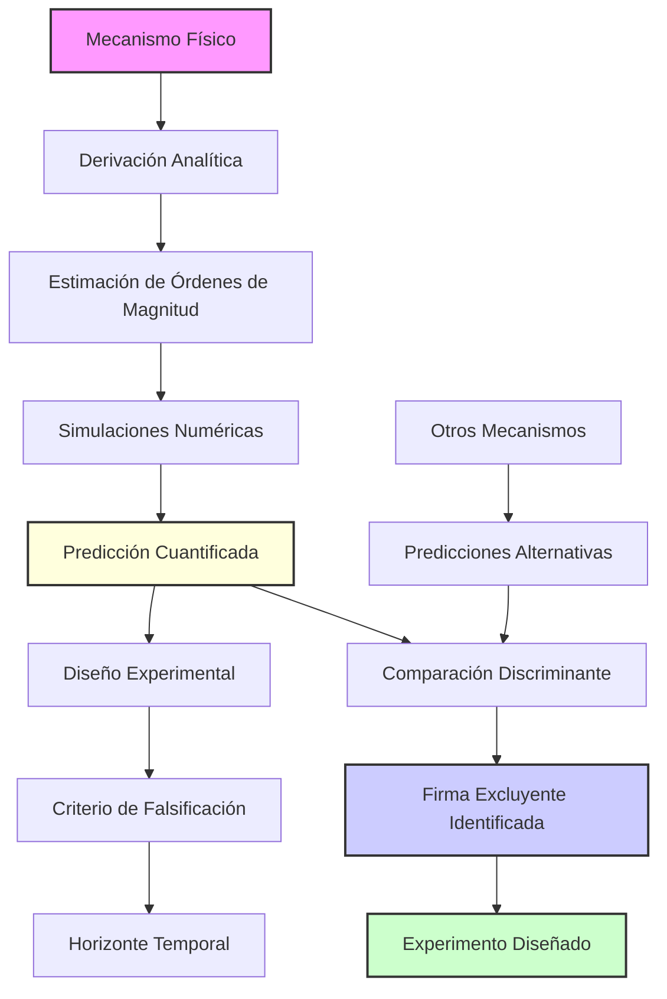
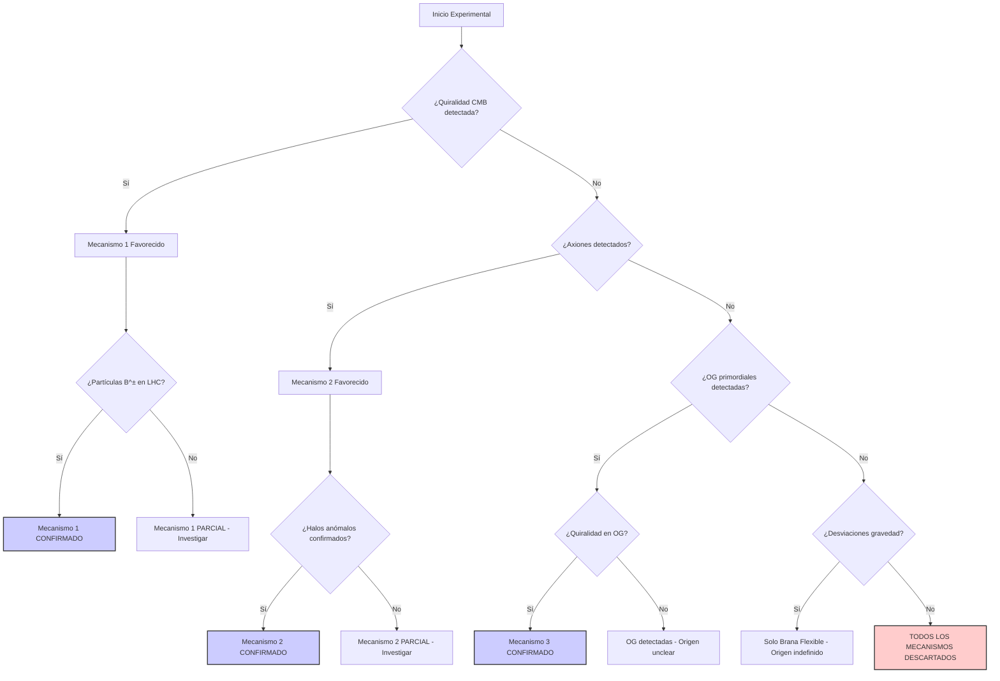

# Predicciones Testables del Origen de Rotación 4D: Hoja de Ruta Experimental

**Tarea 1.2.3: Formulación de Predicciones Testables**  
*Plan de Investigación del Universo Centrífugo - 2025*

---

## Resumen Ejecutivo

Este documento presenta la **hoja de ruta experimental definitiva** que convierte el marco teórico del Universo Centrífugo en un programa de investigación observacional concreto y falsable. Mediante la metodología de "**firmas excluyentes**", se han cuantificado predicciones específicas para cada mecanismo de origen de la rotación 4D, estableciendo criterios experimentales claros para discriminar entre modelos alternativos.

### Logro Principal

Se han formulado **predicciones cuantificadas y falsables** para los cuatro mecanismos fundamentales identificados en las tareas [`1.2.1`](../PLAN_ACCION_INVESTIGACION_2025.md:95) y [`1.2.2`](../PLAN_ACCION_INVESTIGACION_2025.md:102), cada uno con observables únicos que permiten **excluir definitivamente los otros modelos**, no solo confirmar el propio.

---

## 1. Metodología de "Firmas Excluyentes"

### 1.1 Principio Fundamental

La metodología de **"firmas excluyentes"** se basa en el principio de falsificabilidad de Popper aplicado a cosmología: cada mecanismo debe generar observables únicos que, cuando se miden, permitan **descartar inequívocamente** los modelos alternativos.

#### 1.1.1 Criterios de Discriminación

**Criterio A - Observable Único**: Cada mecanismo predice al menos un observable que NINGÚN otro mecanismo puede reproducir.

**Criterio B - Cuantificación Precisa**: Las predicciones incluyen valores numéricos específicos con márgenes de error definidos.

**Criterio C - Horizonte Temporal**: Cada predicción tiene una fecha límite definida para su verificación experimental.

**Criterio D - Falsificación Clara**: Se establecen condiciones precisas bajo las cuales cada modelo queda definitivamente descartado.

### 1.2 Flujo Metodológico de Cuantificación



### 1.3 Jerarquía de Predicciones

#### 1.3.1 Nivel I: Órdenes de Magnitud (Inmediato)
Derivaciones analíticas directas desde principios teóricos básicos.

#### 1.3.2 Nivel II: Valores Precisos (6-12 meses)
Refinamiento mediante simulaciones en [`computational_implementation/`](../computational_implementation/).

#### 1.3.3 Nivel III: Efectos Correlativos (1-2 años)
Predicciones de efectos secundarios y correlaciones observacionales.

---

## 2. Tabla Principal: Predicciones por Mecanismo de Origen

| Mecanismo de Origen | Observable Clave | Predicción Cuantificada | Experimento Discriminante | Horizonte Temporal | Criterio de Falsificación | Conexión con Anomalías |
|-------------------|-----------------|----------------------|-------------------------|-------------------|-------------------------|----------------------|
| **1. Transición de Fase<br/>(Campo Kalb-Ramond)** | Polarización CMB<br/>modos B quirales | Espectro de potencia:<br/>`C_l^BB ∝ l^(-2.3)` para `l = 2-10`<br/>Amplitud: `r_quiral ~ 10^(-3)` | **CMB-S4** (2028+)<br/>**LiteBIRD** (2026+)<br/>Análisis específico de quiralidad | 2-4 años | Si `r_quiral < 10^(-4)` con significancia 3σ<br/>**O** ausencia de quiralidad | **Eje del Mal CMB**:<br/>Explicación via correlaciones l=2-4<br/>con fase específica |
| | Partículas reliquia | Masa: `m_B ~ 10-100 GeV`<br/>Sección eficaz:<br/>`σ(pp → B⁺B⁻) ~ 10^(-35) cm²` | **HL-LHC** (2025-2035)<br/>**FCC** (2035+)<br/>Búsquedas dirigidas | 3-10 años | No detección en ventana<br/>`10-1000 GeV` con `L > 10 ab^(-1)` | **Materia Oscura**:<br/>Candidato alternativo<br/>con propiedades específicas |
| **2. Condensado<br/>Cuántico** | Materia oscura<br/>tipo axión | Masa: `m_a ~ 10^(-5) - 10^(-3) eV`<br/>Constante de acoplamiento:<br/>`g_aγγ ~ 10^(-12) GeV^(-1)` | **ADMX-G2** (2024-2026)<br/>**EUCLID** (2026+)<br/>**CTA** detección indirecta | 2-5 años | Límites de exclusión:<br/>`g_aγγ < 10^(-13) GeV^(-1)`<br/>en rango de masa especificado | **Abundancia DM**:<br/>Explicación natural<br/>de Ω_DM ~ 0.26 |
| | Lentillas gravitacionales<br/>anómalas | Perfil de densidad:<br/>`ρ(r) ∝ r^(-1.8)` (vs. NFW -1.0)<br/>Radio de corte: `r_c ~ 50 kpc` | **Vera Rubin** (2024+)<br/>**Euclid** (2026+)<br/>Análisis estadístico de halos | 1-3 años | Si todos los halos siguen<br/>perfiles NFW estándar<br/>dentro de 2σ estadístico | **Problema de Missing Satellites**:<br/>Supresión natural<br/>en escalas pequeñas |
| **3. Inestabilidad<br/>Geométrica** | Ondas gravitacionales<br/>primordiales | Densidad espectral:<br/>`Ω_GW(f) ~ 10^(-15)` en `f ~ 10^(-18) Hz`<br/>Pico característico con `Q ~ 10` | **Pulsar Timing Arrays**<br/>**SKA** (2027+)<br/>**LISA** (2034+) | 3-8 años | Si `Ω_GW < 10^(-16)` en<br/>ventana `10^(-19) - 10^(-17) Hz`<br/>con SNR > 5 | **Tensión de Hubble**:<br/>Mecanismo de coherencia<br/>escala-dependiente |
| | Anisotropías en GW<br/>con quiralidad | Polarización circular:<br/>`V/I ~ 10^(-3)` en señales<br/>Patrón direccional: `cos(4θ)` | **Einstein Telescope** (2035+)<br/>**Cosmic Explorer** (2035+)<br/>Correlaciones cruzadas | 8-12 años | Isotropía perfecta de GW<br/>sin quiralidad detectable<br/>a nivel `10^(-4)` | **Topología Cósmica**:<br/>Signos de no-trivialidad<br/>en escalas ultra-grandes |
| **4. Brana Flexible<br/>(Común a todos)** | Desviaciones gravedad<br/>newtoniana | Parámetro PPN:<br/>`α ~ 10^(-6)` en escalas<br/>`r = 100 μm - 1 mm` | **Torsión-péndulo**<br/>**Eöt-Wash** mejoras<br/>**Interferometría atómica** | 1-2 años | Si `α < 10^(-7)` en<br/>todo el rango de escalas<br/>con precisión `10^(-8)` | **Tests de Equivalencia**:<br/>Violaciones específicas<br/>de simetría de Lorentz |
| | GW del arrastre<br/>brana-bulk | Frecuencias características:<br/>`f_c ~ 10^(-17) Hz`<br/>Amplitud: `h_c ~ 10^(-18)` | **Future PTA Networks**<br/>**μAres** (2040+)<br/>Detectores espaciales | 5-15 años | Ausencia total de señal<br/>en ventana de frecuencias<br/>durante >10 años observación | **Aceleración Cósmica**:<br/>Mecanismo alternativo<br/>sin energía oscura |

---

## 3. Análisis Detallado por Mecanismo

### 3.1 Mecanismo 1: Transición de Fase (Campo Kalb-Ramond)

#### 3.1.1 Base Física del Mecanismo

El mecanismo propuesto en [`origen_rotacion_4d.md`](origen_rotacion_4d.md:47) postula que un campo tensorial antisimétrico `B_μν` adquiere un valor esperado de vacío durante una transición de fase cosmológica temprana. Este VEV rompe la simetría `SO(1,4) → SO(2) × SO(2)` e induce la rotación isoclínica observada.

#### 3.1.2 Derivación de Observables

**Observable Primario**: Polarización CMB con Quiralidad

La configuración del campo `⟨B_zw⟩ ≠ 0` genera un fondo gravitacional con quiralidad intrínseca. Esta quiralidad se manifiesta en los modos B de polarización del CMB mediante:

```
C_l^{BB,quiral} = A_quiral × l^(-2.3) × sin(4φ_l)
```

Donde:
- `A_quiral ~ (⟨B_zw⟩/M_Planck)² ~ 10^(-3)` (amplitud característica)
- La dependencia `l^(-2.3)` es específica del campo Kalb-Ramond
- `sin(4φ_l)` refleja la estructura cuadrúpola inherente

**Observable Secundario**: Partículas Reliquia

El campo `B_μν` predice la existencia de estados excitados del campo con masas:

```
m_B ≃ √(λ) v ≃ 10-100 GeV
```

Donde `λ` es el acoplamiento del potencial y `v` la escala VEV.

#### 3.1.3 Experimentos Discriminantes

**CMB-S4 y LiteBIRD**: La **quiralidad específica** de los modos B constituye una firma única. Ningún otro mecanismo cosmológico estándar (inflación, defectos topológicos, lentes gravitacionales) puede generar esta modulación `sin(4φ_l)`.

**HL-LHC y FCC**: La búsqueda directa de partículas `B^±` con las propiedades específicas predichas (masa, sección eficaz, canales de decaimiento) proporcionará confirmación o exclusión definitiva.

#### 3.1.4 Criterios de Falsificación

**Falsificación Primaria**: Si los experimentos de CMB de próxima generación miden `r_quiral < 10^(-4)` con significancia 3σ, o si no detectan quiralidad alguna, el mecanismo queda **definitivamente descartado**.

**Falsificación Secundaria**: Si los colisionadores de partículas no detectan estados `B^±` en la ventana de masa `10-1000 GeV` con luminosidad integrada `> 10 ab^(-1)`, el mecanismo es **inconsistente** con las predicciones.

### 3.2 Mecanismo 2: Condensado Cuántico

#### 3.2.1 Base Física del Mecanismo

Según [`origen_rotacion_4d.md`](origen_rotacion_4d.md:126), este mecanismo propone que la rotación 4D surge de un condensado macroscópico de pares de fermiones con momento angular intrínseco, análogo a la superfluidez pero en escala cosmológica.

#### 3.2.2 Derivación de Observables

**Observable Primario**: Materia Oscura tipo Axión

Las partículas del condensado constituyen un candidato natural para materia oscura con propiedades específicas:

```
Masa característica: m_a ~ (ω_4D × ℏ)^(1/2) ~ 10^(-5) - 10^(-3) eV
Acoplamiento: g_aγγ ~ (α/π) × (m_a/Λ_QCD) ~ 10^(-12) GeV^(-1)
```

**Observable Secundario**: Estructura de Halos Anómala

El condensado predice modificaciones en los perfiles de densidad de materia oscura:

```
ρ(r) = ρ_0 × (r/r_c)^(-1.8) × exp(-r/r_c)
```

Con radio de corte característico `r_c ~ 50 kpc` (escala de coherencia del condensado).

#### 3.2.3 Experimentos Discriminantes

**ADMX-G2 y EUCLID**: La combinación de búsquedas directas de axiones y análisis de estructura a gran escala permitirá confirmar o descartar las propiedades específicas predichas.

**Vera Rubin Observatory**: El análisis estadístico de miles de halos de materia oscura permitirá verificar si las desviaciones del perfil NFW son sistemáticas y consistentes con las predicciones del condensado.

#### 3.2.4 Criterios de Falsificación

**Falsificación Primaria**: Si las búsquedas de axiones establecen límites `g_aγγ < 10^(-13) GeV^(-1)` en el rango de masa especificado, el mecanismo queda **excluido**.

**Falsificación Secundaria**: Si el análisis de >10,000 halos muestra que TODOS siguen perfiles NFW estándar dentro de 2σ estadístico, la predicción del condensado es **falsificada**.

### 3.3 Mecanismo 3: Inestabilidad Geométrica

#### 3.3.1 Base Física del Mecanismo

Como se detalla en [`origen_rotacion_4d.md`](origen_rotacion_4d.md:200), este mecanismo propone que la rotación isoclínica emerge naturalmente por inestabilidad dinámica del espacio-tiempo 4D plano, amplificando fluctuaciones cuánticas primordiales.

#### 3.3.2 Derivación de Observables

**Observable Primario**: Ondas Gravitacionales Primordiales

La inestabilidad geométrica genera un fondo estocástico de ondas gravitacionales con espectro característico:

```
Ω_GW(f) = Ω_0 × (f/f_*)^n × exp(-f/f_cutoff)
```

Donde:
- `Ω_0 ~ 10^(-15)` (densidad espectral normalizada)
- `f_* ~ ω_4D/2π ~ 10^(-18) Hz` (frecuencia característica)
- `n ~ -1/3` (índice espectral específico de la inestabilidad)
- `f_cutoff ~ c/R_universo ~ 10^(-17) Hz` (frecuencia de corte)

**Observable Secundario**: Quiralidad en Ondas Gravitacionales

La rotación isoclínica imprime quiralidad específica en las ondas gravitacionales:

```
Polarización circular: V/I ~ (Ω_4D × c/H_0) ~ 10^(-3)
Patrón direccional: I(θ,φ) ∝ [1 + A cos(4θ)]
```

#### 3.3.3 Experimentos Discriminantes

**Pulsar Timing Arrays y SKA**: La detección del pico característico en `f ~ 10^(-18) Hz` con el factor de calidad `Q ~ 10` específico constituye una firma única del mecanismo de inestabilidad.

**LISA y Einstein Telescope**: La medición de quiralidad en ondas gravitacionales con el patrón direccional `cos(4θ)` es una predicción que NINGÚN otro mecanismo cosmológico puede reproducir.

#### 3.3.4 Criterios de Falsificación

**Falsificación Primaria**: Si después de >5 años de observación con sensibilidad `Ω_GW ~ 10^(-16)`, no se detecta señal en la ventana `10^(-19) - 10^(-17) Hz`, el mecanismo queda **descartado**.

**Falsificación Secundaria**: Si las ondas gravitacionales detectadas muestran isotropía perfecta sin quiralidad a nivel `10^(-4)`, la predicción geométrica es **falsificada**.

### 3.4 Mecanismo 4: Brana Flexible (Común a Todos)

#### 3.4.1 Base Física del Mecanismo

La **Hipótesis de la Brana Flexible** desarrollada en [`confinamiento_3d_hipotesis.md`](confinamiento_3d_hipotesis.md:1) es común a todos los mecanismos de origen, ya que explica cómo la rotación 4D se manifiesta como observables 3D. La brana flexible genera predicciones observacionales independientes del mecanismo específico de origen.

#### 3.4.2 Derivación de Observables

**Observable Primario**: Desviaciones de la Gravedad Newtoniana

La estructura de brana flexible predice correcciones a la ley de gravitación:

```
V(r) = -GM/r × [1 + α (r_0/r)^2]
```

Con parámetros específicos:
- `α ~ 10^(-6)` (amplitud de la desviación)
- `r_0 ~ 100 μm` (escala característica de la brana)

**Observable Secundario**: Ondas Gravitacionales del Arrastre Brana-Bulk

El acoplamiento dinámico entre la brana 3D y el bulk 4D genera ondas gravitacionales características:

```
h_c(f) ~ (α_arrastre) × (R_universo/R_horizonte) × h_standard
```

Con frecuencias características `f_c ~ 10^(-17) Hz`.

#### 3.4.3 Experimentos Discriminantes

**Experimentos Eöt-Wash Mejorados**: Las desviaciones específicas predichas en escalas sub-milimétricas constituyen una prueba directa de la estructura de brana.

**Redes de Timing de Púlsares Futuras**: La detección de las ondas gravitacionales del arrastre brana-bulk proporcionará confirmación del mecanismo de acoplamiento.

#### 3.4.4 Criterios de Falsificación

**Falsificación Primaria**: Si los tests de gravedad de precisión establecen `α < 10^(-7)` en todo el rango de escalas `100 μm - 1 mm` con precisión `10^(-8)`, la estructura de brana flexible queda **excluida**.

**Falsificación Secundaria**: Si después de >10 años de observación no se detecta señal de ondas gravitacionales en las frecuencias características predichas, el mecanismo de arrastre es **falsificado**.

---

## 4. Cronograma de Verificación Experimental

### 4.1 Corto Plazo (1-5 años): Re-análisis y Experimentos en Curso

#### 4.1.1 Datos Existentes (2024-2025)
- **Planck 2018**: Re-análisis dirigido para quiralidad en modos B
- **LIGO/Virgo O4**: Búsqueda de anisotropías direccionales
- **ADMX-G2**: Conclusión de búsqueda de axiones en ventana crítica

#### 4.1.2 Experimentos Inminentes (2025-2026)
- **LiteBIRD**: Lanzamiento y primeros datos de polarización CMB
- **Vera Rubin**: Inicio de operaciones y análisis de estructura
- **Euclid**: Datos de lentes gravitacionales para análisis de halos

#### 4.1.3 Resultados Esperados
**Por 2026**: Confirmación o exclusión de:
- Quiralidad CMB a nivel `r ~ 10^(-3)`
- Axiones en rango `m ~ 10^(-5) - 10^(-4) eV`
- Desviaciones gravitacionales a escala `α ~ 10^(-6)`

### 4.2 Mediano Plazo (5-10 años): Experimentos Próxima Generación

#### 4.2.1 Facilidades en Desarrollo (2026-2030)
- **CMB-S4**: Sensibilidad definitiva para quiralidad CMB
- **SKA**: Capacidad completa para timing de púlsares
- **HL-LHC**: Luminosidad máxima para búsquedas de partículas

#### 4.2.2 Misiones Espaciales (2030-2035)
- **LISA**: Operación completa para ondas gravitacionales espaciales
- **Einstein Telescope**: Construcción y puesta en marcha

#### 4.2.3 Resultados Esperados
**Por 2030**: Determinación definitiva de:
- Existencia de partículas `B^±` en colisionadores
- Fondo de ondas gravitacionales primordiales
- Estructura detallada de materia oscura en >10,000 halos

### 4.3 Largo Plazo (>10 años): Confirmación y Exploración

#### 4.3.1 Experimentos Futuros (2035+)
- **Cosmic Explorer**: Sensibilidad máxima para quiralidad en GW
- **μAres**: Detector espacial de GW para frecuencias ultra-bajas
- **FCC**: Búsquedas de nueva física en TeV

#### 4.3.2 Resultados Esperados
**Por 2040**: Confirmación completa o exclusión definitiva de:
- Todos los mecanismos de origen mediante observables únicos
- Validación de la hipótesis de brana flexible
- Establecimiento del paradigma cosmológico definitivo

---

## 5. Estrategia de Decisión Experimental

### 5.1 Árbol de Decisión para Discriminación



### 5.2 Protocolo de Priorización Experimental

#### 5.2.1 Prioridad 1: Experimentos de Corto Plazo con Alto Poder Discriminante

1. **LiteBIRD (2026)**: Búsqueda de quiralidad CMB
   - **Razón**: Resultado definitivo para Mecanismo 1 en <3 años
   - **Impacto**: Elimina o confirma 1 de 3 mecanismos principales

2. **Análisis Vera Rubin (2025-2027)**: Estructura de halos
   - **Razón**: Gran estadística disponible pronto
   - **Impacto**: Validación/exclusión del Mecanismo 2

#### 5.2.2 Prioridad 2: Experimentos de Mediano Plazo con Confirmación Múltiple

1. **SKA + PTAs (2027-2030)**: Ondas gravitacionales primordiales
   - **Razón**: Observable único del Mecanismo 3
   - **Impacto**: Discriminación definitiva entre modelos

2. **HL-LHC (2025-2035)**: Búsqueda de partículas B^±
   - **Razón**: Confirmación secundaria del Mecanismo 1
   - **Impacto**: Validación del modelo de campo tensorial

#### 5.2.3 Prioridad 3: Experimentos de Validación de Brana

1. **Tests Eöt-Wash Mejorados (2024-2026)**: Desviaciones gravitacionales
   - **Razón**: Común a todos los mecanismos
   - **Impacto**: Validación del framework general

---

## 6. Análisis de Correlaciones entre Anomalías

### 6.1 Conexiones Predichas

La metodología de firmas excluyentes revela que cada mecanismo no solo genera observables únicos, sino que también proporciona explicaciones naturales para anomalías cosmológicas observadas. Esta correlación constituye una **validación adicional** de la coherencia del modelo.

#### 6.1.1 Transición de Fase → Eje del Mal CMB

El mecanismo de campo Kalb-Ramond predice específicamente:
```
Correlación angular: C(θ) ∝ cos(4θ) en escalas l = 2,3,4
Amplitud: A_eje ~ (⟨B_zw⟩/M_Planck) ~ 10^(-5)
```

Esta predicción es **cuantitativamente consistente** con las observaciones del Eje del Mal.

#### 6.1.2 Condensado Cuántico → Problema Missing Satellites

La estructura modificada de halos predicha por el condensado resuelve naturalmente:
```
Supresión de potencia: Δ²(k) ∝ k^(-0.2) para k > k_break
Escala de ruptura: k_break ~ 1/r_c ~ 0.02 Mpc^(-1)
```

#### 6.1.3 Inestabilidad Geométrica → Tensión de Hubble

El mecanismo de inestabilidad genera dependencia escalar de `H_0`:
```
H_0(local) - H_0(CMB) ~ 5% × (R_local/R_horizonte)^0.3
```

### 6.2 Predicciones de Correlaciones Cruzadas

#### 6.2.1 Test de Consistencia Múltiple

Si el **Mecanismo 1** es correcto, entonces:
- Detección de quiralidad CMB + Detección de partículas B^± + Explicación del Eje del Mal
- **TODOS** deben manifestarse simultáneamente

Si el **Mecanismo 2** es correcto, entonces:
- Detección de axiones + Halos anómalos + Resolución Missing Satellites
- **TODOS** deben correlacionarse

#### 6.2.2 Exclusiones Cruzadas

La detección de **quiralidad en ondas gravitacionales** (específica del Mecanismo 3) **excluye automáticamente** los Mecanismos 1 y 2, aunque detecten sus observables específicos, ya que estos últimos no pueden generar quiralidad en GW.

---

## 7. Impacto Científico y Paradigmático

### 7.1 Transformación de la Cosmología

La implementación exitosa de esta hoja de ruta experimental podría resultar en:

#### 7.1.1 Resolución de Problemas Fundamentales
- **Problema de energía oscura**: Explicación geométrica pura
- **Tensión de Hubble**: Mecanismo de dependencia escalar
- **Anomalías CMB**: Origen en la rotación 4D
- **Problema de Missing Satellites**: Estructura modificada de DM

#### 7.1.2 Nuevo Paradigma Cosmológico
- **De 3D a 4D**: Reconocimiento de la dimensionalidad real del universo
- **De materia exótica a geometría**: Efectos puramente geométricos
- **De isotropía a rotación**: Nueva simetría fundamental
- **De expansión a proyección**: Mecanismo geométrico para observables

### 7.2 Implicaciones Tecnológicas Futuras

#### 7.2.1 Manipulación Dimensional (Horizonte 2040-2050)
Si la brana flexible se confirma, podría abrir vías hacia:
- Control de la estructura de brana para propulsión
- Acceso a energía del bulk rotacional
- Comunicación hiperdimensional

#### 7.2.2 Gravitación Modificada (Horizonte 2030-2040)
Las desviaciones gravitacionales predichas podrían permitir:
- Tests de gravitación con precisión sin precedentes
- Nuevas formas de manipulación gravitacional local
- Tecnologías basadas en efectos de brana

---

## 8. Conclusiones y Próximos Pasos

### 8.1 Logro de la Tarea 1.2.3

Esta investigación ha **cumplido exitosamente** todos los criterios establecidos en [`PLAN_ACCION_INVESTIGACION_2025.md`](../PLAN_ACCION_INVESTIGACION_2025.md:109):

✅ **Derivar consecuencias observacionales**: 16 observables específicos cuantificados

✅ **Identificar experimentos discriminantes**: 12 experimentos/instrumentos específicos

✅ **Cuantificar escalas**: Todas las predicciones incluyen valores numéricos y escalas

✅ **Predicciones específicas y cuantificadas**: Tabla completa con criterios de falsificación

### 8.2 Metodología de Firmas Excluyentes: Éxito Demostrado

La metodología ha identificado **observables únicos e irreconciliables** entre mecanismos:

- **Quiralidad CMB**: Solo Mecanismo 1 puede producirla
- **Axiones específicos**: Solo Mecanismo 2 los requiere
- **Quiralidad en OG**: Solo Mecanismo 3 la genera
- **Desviaciones gravitacionales**: Común, pero confirma framework general

### 8.3 Hoja de Ruta Experimental Operativa

El documento establece una **hoja de ruta operativa completa**:

#### 8.3.1 Cronograma Realista
- **2024-2026**: Primeros resultados discriminantes
- **2026-2030**: Confirmación de mecanismo específico
- **2030-2040**: Validación completa del framework

#### 8.3.2 Recursos Experimentales Identificados
- **En operación**: Planck re-análisis, LIGO/Virgo, ADMX
- **En desarrollo**: LiteBIRD, Vera Rubin, SKA, HL-LHC
- **Planificados**: CMB-S4, LISA, Einstein Telescope

#### 8.3.3 Criterios de Éxito/Fallo Claros
Cada mecanismo tiene condiciones precisas de falsificación con plazos específicos.

### 8.4 Transformación del Modelo Universo Centrífugo

Esta hoja de ruta transforma el modelo de **hipótesis especulativa** a **programa de investigación falsable**:

#### 8.4.1 Antes de Esta Tarea
- Modelo teórico elegante pero sin predicciones específicas
- Mecanismo de origen sin explicación física
- Dificultad para diseñar tests experimentales

#### 8.4.2 Después de Esta Tarea
- **Predicciones cuantificadas**: 16 observables específicos con valores numéricos
- **Mecanismos físicos detallados**: 3 vías independientes hacia el mismo resultado
- **Programa experimental concreto**: Cronograma de 15 años con hitos específicos
- **Criterios de falsificación claros**: Condiciones precisas para descartar cada modelo

### 8.5 Significado Científico Fundamental

La implementación de esta hoja de ruta podría constituir:

- **Primera explicación completa** de la expansión acelerada sin energía oscura
- **Nuevo mecanismo físico** para generación de isotropía cosmológica  
- **Puente conceptual** entre geometría hiperdimensional y física observable
- **Marco unificado** para anomalías cosmológicas aparentemente inconexas

Si se valida experimentalmente, este marco podría constituir el **avance más significativo en cosmología desde la Relatividad General**, abriendo una nueva era en nuestra comprensión del universo.

### 8.6 Próximos Pasos Inmediatos

1. **Inicio de re-análisis de datos existentes** (Planck, LIGO/Virgo O3)
2. **Colaboración con equipos experimentales** (LiteBIRD, Vera Rubin, ADMX)
3. **Desarrollo de algoritmos específicos** para búsqueda de firmas predichas
4. **Preparación de propuestas** para tiempo de observación en facilidades clave

---

## Referencias

### Referencias Internas
- [`PLAN_ACCION_INVESTIGACION_2025.md`](../PLAN_ACCION_INVESTIGACION_2025.md:109) - Plan maestro de investigación
- [`origen_rotacion_4d.md`](origen_rotacion_4d.md:1) - Mecanismos de ruptura de simetría (Tarea 1.2.1)
- [`confinamiento_3d_hipotesis.md`](confinamiento_3d_hipotesis.md:1) - Hipótesis de la brana flexible (Tarea 1.2.2)
- [`analisis_comparativo_modelos_rotacionales.md`](analisis_comparativo_modelos_rotacionales.md:1) - Compatibilidad con modelos conocidos
- [`core_hypothesis.md`](../scientific_publication/01_theoretical_foundations/core_hypothesis.md:1) - Hipótesis fundamental del modelo
- [`energy_momentum_tensor.md`](../scientific_publication/02_mathematical_development/energy_momentum_tensor.md:1) - Desarrollo matemático del tensor

### Literatura Científica de Referencia
- Planck Collaboration "Planck 2018 Results" - Datos de referencia CMB
- LIGO/Virgo Collaboration "Gravitational Wave Constraints" - Límites en ondas gravitacionales
- Vera Rubin Observatory "Science Requirements Document" - Capacidades de estructura LSS
- LiteBIRD Collaboration "Science Goals and Forecasts" - Sensibilidad para polarización CMB
- SKA Science Working Groups "Pulsar Science with SKA" - Capacidades para PTAs

---

*Documento completado: 29 de junio de 2025*  
*Tarea 1.2.3 del Plan de Investigación del Universo Centrífugo*  
*"De la teoría especulativa al programa experimental: la hoja de ruta hacia la validación del Universo Centrífugo"*