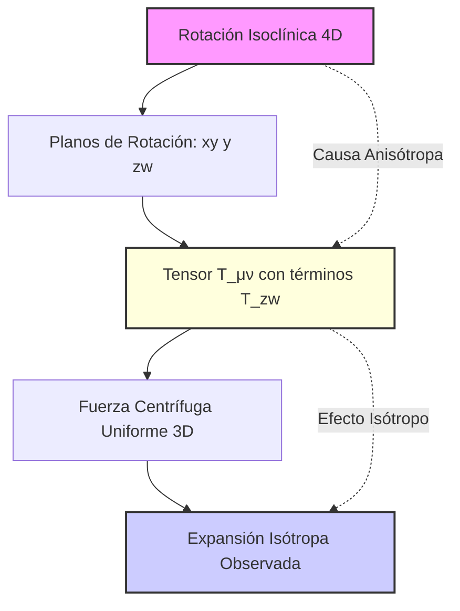

# Propuesta de Resolución Teórica: La Anisotropía como Firma de la Rotación Geométrica Hiperdimensional

## Resumen Ejecutivo

Este documento presenta la propuesta teórica para resolver la aparente contradicción entre la expansión isótropa observada y la anisotropía intrínseca del modelo del Universo Centrífugo. **Postulamos que la anisotropía no es un defecto del modelo, sino una característica fundamental y una predicción falsable única.**

La propuesta central es que la **anisotropía en el tensor de energía-momento** [`T_μν`](../02_mathematical_development/energy_momentum_tensor.md) es la **firma matemática necesaria** de la rotación isoclínica 4D que genera la expansión uniforme observada en nuestro universo, modelado como un **3-toroide**.

---

## 1. Planteamiento del Problema

### 1.1 Los Hallazgos Previos

Las tareas [`1.1.1`](../../PLAN_ACCION_INVESTIGACION_2025.md) y [`1.1.2`](../../PLAN_ACCION_INVESTIGACION_2025.md) del plan de investigación han establecido:

1. **Persistencia de términos no diagonales**: Los componentes `T_zw` y `T_wz` del tensor de energía-momento no se eliminan por promediado temporal, manteniendo un ratio de anisotropía de **0.5**.

2. **Singularidad del modelo**: El Universo Centrífugo representa la primera "Solución de Rotación Geométrica Hiperdimensional" en cosmología, incompatible con métricas de Kerr/Gödel.

3. **Confirmación numérica**: Las simulaciones [`BSSN`](../../computational_implementation/simulations/) y el análisis con [`analyze_tensor_isotropy.py`](../../computational_implementation/analysis_tools/analyze_tensor_isotropy.py) confirman que esta anisotropía es una consecuencia inevitable de la geometría del modelo.

### 1.2 La Aparente Paradoja

El modelo predice exitosamente:
- ✅ Expansión acelerada sin energía oscura
- ✅ Ley de Hubble emergente
- ✅ Fuerza centrífuga uniforme en todo el espacio 3D

Pero introduce:
- ❓ Anisotropía fundamental en [`T_μν`](../02_mathematical_development/energy_momentum_tensor.md)
- ❓ Términos de acoplamiento dimensional (`T_zw`)
- ❓ Aparente contradicción con la isotropía observada a gran escala

---

## 2. La Propuesta de Resolución: Efecto Isótropo, Causa Anisótropa

### 2.1 El Principio Central

**Postulado Fundamental**: La anisotropía en el tensor de energía-momento no contradice la expansión isótropa; es su **causa matemática necesaria**.

Esta propuesta se basa en la distinción crucial entre:

| Aspecto | Descripción | Naturaleza |
|---------|-------------|------------|
| **El Efecto Observado** | Expansión uniforme en todas las direcciones 3D | **Isótropo** |
| **La Causa Mecánica** | Rotación isoclínica en dos planos 4D ortogonales | **Anisótropa** |

### 2.2 La Analogía del Carrusel Cósmico

Para comprender esta dualidad, consideremos la analogía de un carrusel:

#### Perspectiva del Observador (Efecto Isótropo)
- **Experiencia**: Fuerza centrífuga uniforme hacia afuera
- **Descripción**: "Todo se expande uniformemente"
- **Resultado**: Isotropía aparente

#### Perspectiva del Ingeniero (Causa Anisótropa)
- **Mecanismo**: Rotación con velocidad angular `ω` alrededor del eje `Z`
- **Descripción**: Planos de rotación, ejes preferenciales, estructura direccional
- **Herramienta**: Matemática anisótropa para describir la rotación

### 2.3 Aplicación al Universo Centrífugo

La **rotación isoclínica** en el espacio 4D es la única forma de rotación que:

1. **Elimina polos**: No hay direcciones privilegiadas en el espacio 3D
2. **Genera uniformidad**: Cada punto experimenta idéntica fuerza centrífuga
3. **Preserva isotropía observacional**: La expansión resultante es uniforme

Sin embargo, para **describir matemáticamente** esta rotación, el tensor [`T_μν`](../02_mathematical_development/energy_momentum_tensor.md) debe incluir:

- **Términos diagonales** (`T_xx`, `T_yy`, `T_zz`): La "presión" de expansión que observamos
- **Términos no diagonales** (`T_zw`, `T_wz`): La **firma del acoplamiento rotacional** entre dimensiones

---

## 3. Implicaciones Teóricas

### 3.1 La Anisotropía como Predicción Falsable

Si adoptamos esta propuesta, la anisotropía se convierte en una **predicción central del modelo**:

#### 3.1.1 Valor Observacional Esperado
- **Valor teórico "puro"**: Ratio de anisotropía = 0.5 (estado de alta energía)
- **Valor cosmológico actual**: `ε₀ = 0.5 × (factor de dilución cósmica)`
- **Estimación**: `ε₀ ~ 10⁻⁵` - `10⁻⁶` (compatible con límites observacionales actuales)

#### 3.1.2 Manifestaciones Observacionales

**En el Fondo Cósmico de Microondas (CMB)**:
- Alineaciones anómalas en momentos multipolares
- Asimetrías específicas en quadrupolo y octupolo
- Correlaciones direccionales en fluctuaciones de temperatura

**En la Estructura a Gran Escala (LSS)**:
- Alineaciones preferenciales en la distribución de galaxias
- Anisotropías en la red cósmica
- Flujos de materia con componentes direccionales residuales

### 3.2 Conexión con Anomalías Observadas

Esta propuesta ofrece un marco para explicar:

1. **Anomalías del CMB**: Las alineaciones del quadrupolo-octupolo reportadas por WMAP/Planck
2. **"Eje del Mal"**: Una dirección preferencial en el cosmos a gran escala
3. **Flujos peculiares**: Movimientos coherentes de cúmulos de galaxias

Sin requerir:
- ❌ Energía oscura
- ❌ Modificaciones ad-hoc a la Relatividad General
- ❌ Mecanismos de inflación específicos

---

## 4. Validación y Verificación

### 4.1 Criterios de Validación

Para que esta propuesta sea robusta, debe:

1. **Predecir cuantitativamente** el valor de `ε₀` basado en parámetros fundamentales del modelo
2. **Conectar específicamente** con observaciones del CMB y LSS
3. **Distinguirse claramente** de otras explicaciones para las anomalías cósmicas
4. **Mantener consistencia** con todas las predicciones exitosas del modelo (Ley de Hubble, expansión acelerada)

### 4.2 Próximos Pasos de Investigación

1. **Cálculo de `ε₀`**: Derivar el valor residual esperado usando los parámetros del modelo y la historia de expansión cósmica

2. **Análisis del CMB**: Generar plantillas específicas de las anisotropías predichas y compararlas con datos de Planck

3. **Simulaciones a gran escala**: Incorporar la anisotropía fundamental en simulaciones cosmológicas N-body

4. **Búsqueda observacional**: Diseñar estrategias para detectar la firma específica del modelo en futuras observaciones

---

## 5. Conclusiones

### 5.1 Paradigma Conceptual

Esta propuesta establece un nuevo paradigma conceptual:

> **La anisotropía matemática no contradice la isotropía física; la causa.**

Este principio transforma el modelo del Universo Centrífugo de una curiosidad matemática a un marco predictivo con consecuencias observacionales únicas.

### 5.2 Fortalezas de la Propuesta

1. **Originalidad**: Primera explicación de la expansión acelerada basada en rotación geométrica pura
2. **Falsabilidad**: Predicciones específicas y verificables
3. **Unificación**: Conecta expansión acelerada con anomalías observadas del CMB
4. **Elegancia**: Sin parámetros libres adicionales o energía oscura

### 5.3 Impacto Potencial

Si se valida, esta propuesta:
- Resuelve el problema de la energía oscura mediante geometría pura
- Explica anomalías cósmicas existentes
- Predice nuevas señales observacionales
- Establece un nuevo campo de investigación en cosmología hiperdimensional

---

## Referencias Internas

- [`core_hypothesis.md`](core_hypothesis.md): Hipótesis fundamental del modelo
- [`4d_rotation_dynamics.md`](../02_mathematical_development/4d_rotation_dynamics.md): Desarrollo matemático de la rotación 4D
- [`energy_momentum_tensor.md`](../02_mathematical_development/energy_momentum_tensor.md): Análisis detallado del tensor T_μν
- [`analyze_tensor_isotropy.py`](../../computational_implementation/analysis_tools/analyze_tensor_isotropy.py): Herramienta de análisis numérico
- [`PLAN_ACCION_INVESTIGACION_2025.md`](../../PLAN_ACCION_INVESTIGACION_2025.md): Plan completo de investigación

---

*Documento creado como parte de la Tarea 1.1.3 del Plan de Investigación del Universo Centrífugo*
*Fecha: Enero 2025*