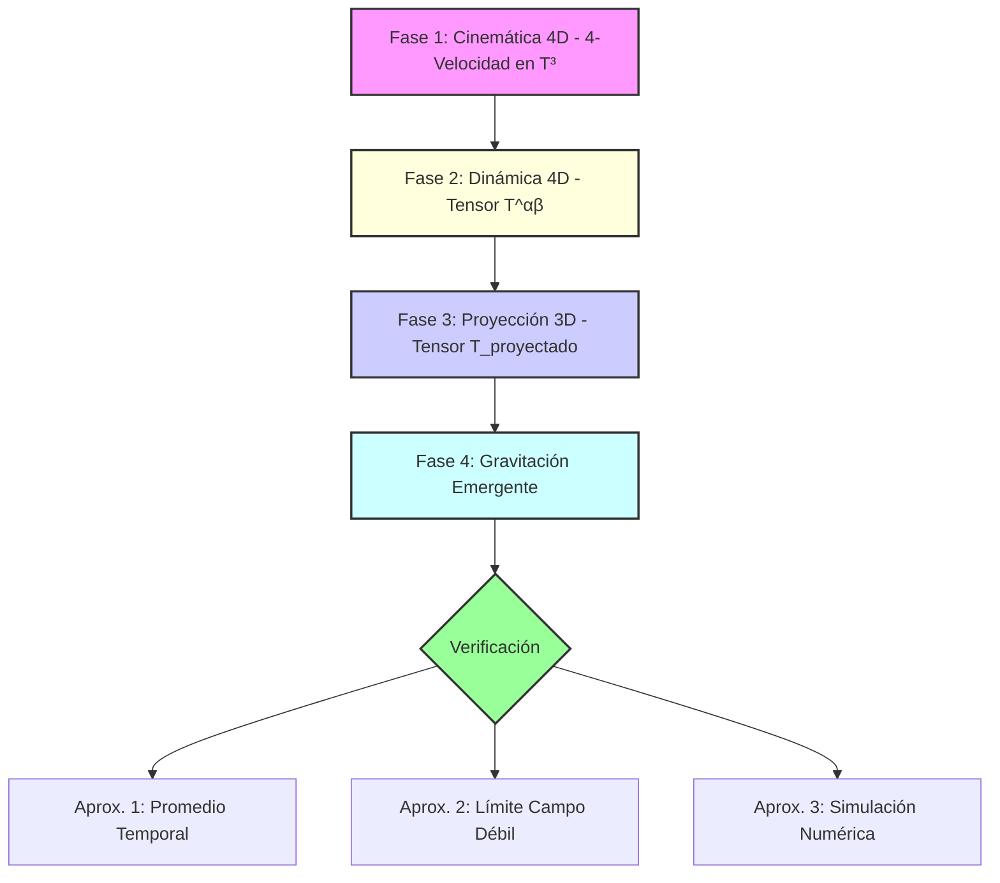

# Metodología de Desarrollo y Verificación para la Gravedad Emergente

*Versión: 1.0 - Fecha: 26 de septiembre de 2025*

## 1. Resumen de la Metodología

Esta sección detalla el marco metodológico completo utilizado para desarrollar y verificar la hipótesis de la gravedad como un fenómeno emergente de la dinámica rotacional en un hiperespacio 4D con topología de 3-toroide. El enfoque se divide en dos etapas principales: el desarrollo matemático del modelo desde primeros principios y la posterior verificación a través de aproximaciones físicas y computacionales.

A continuación se presenta un diagrama conceptual del flujo de trabajo:

---

## 2. Desarrollo del Modelo Matemático

El desarrollo se descompone en cuatro fases lógicas para construir el campo gravitacional a partir de la cinemática fundamental.

### Fase 1: Cinemática 4D

El objetivo es describir el movimiento de una partícula en reposo sobre un 3-toroide, arrastrada por una rotación isoclínica en el hiperespacio 4D. Esto nos permite derivar su 4-velocidad (`U^α`), que resulta estar confinada al plano de rotación `zw`, simplificando la base cinemática del modelo.

### Fase 2: Dinámica 4D

A partir de la 4-velocidad, se construye el Tensor Energía-Momento (`T^αβ`) en el espacio 4D utilizando la relación `T^αβ ∝ U^α * U^β`. El tensor resultante es simétrico y sus componentes no nulas se localizan exclusivamente en el subespacio `zw`, confirmando que toda la energía y momento están contenidos en el plano de rotación.

### Fase 3: Proyección 3D

Para determinar qué observaría un habitante del 3-toroide, el tensor 4D se proyecta sobre la hipersuperficie 3D. Esta proyección transforma una dinámica 4D simple en un tensor 3D observable (`T_projected^αβ`) denso y complejo, con componentes no nulas en todas las direcciones. Este tensor proyectado representa la distribución de energía, presión y flujos de momento que emergen de la rotación subyacente.

### Fase 4: Gravitación Emergente

El `T_projected^αβ` se postula como la fuente del campo gravitacional en las Ecuaciones de Campo de Einstein: `G_μν(g) = 8πG * T_projected_μν`. La solución a este sistema de ecuaciones define la métrica `g_μν` del espacio-tiempo, donde la gravedad emerge no de la materia, sino de la geometría y cinemática del hiperespacio.

---

## 3. Estrategia de Verificación

Dado que una solución analítica directa de las ecuaciones de campo es inviable, se emplean tres enfoques de aproximación para verificar la consistencia del modelo con la gravedad observada.

### Aproximación 1: Promedio Temporal

Se promedia el tensor proyectado a lo largo de un ciclo de rotación 4D para obtener un campo gravitacional efectivo y estático. El resultado es un tensor estático (`⟨T_μν⟩`) con presiones anisótropas, indicando que el campo gravitacional resultante no sería esféricamente simétrico, sino que conservaría una "memoria" de la rotación 4D, similar a una fuente rotacional como la descrita por la métrica de Kerr.

### Aproximación 2: Límite de Campo Débil

Se analiza el modelo a grandes distancias, donde la curvatura del espacio-tiempo es una pequeña perturbación sobre un espacio plano. Se demuestra que el potencial gravitacional decae como `1/r` y que la energía total del sistema converge a una masa efectiva finita (`M_eff`), lo que es totalmente consistente con el potencial gravitacional de Newton. Esta es una verificación crucial de la validez del modelo a escala macroscópica.

### Aproximación 3: Simulación Numérica

Se emplea una simulación numérica completa de las ecuaciones de Einstein, utilizando el tensor promediado `⟨T_μν⟩` como fuente. El objetivo es obtener un mapa del espacio-tiempo y validar su estabilidad y coherencia física. La validación no busca una coincidencia exacta con soluciones conocidas (como Schwarzschild), sino confirmar que la métrica resultante es estable, asintóticamente plana y que las geodésicas predicen fenómenos consistentes con las observaciones astronómicas, como órbitas estables.